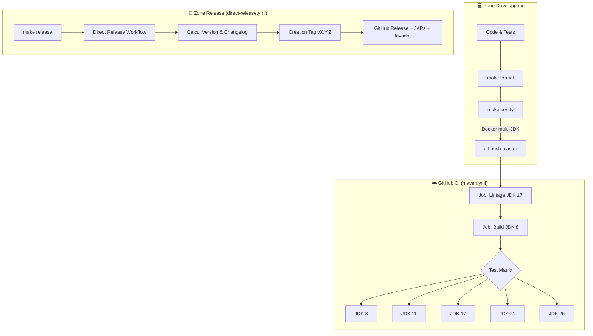
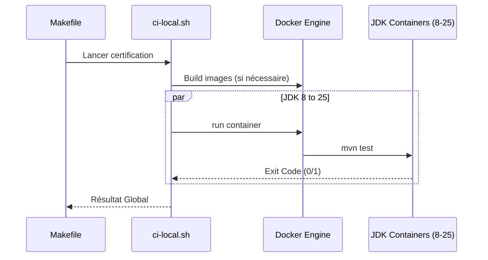
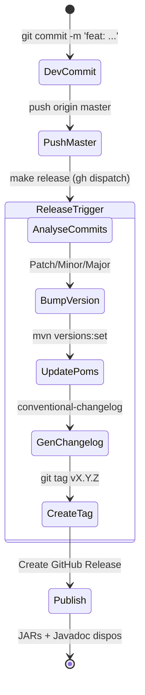

# 🏗️ Documentation CI/CD ScribeJava

Ce document détaille l'infrastructure de Continuous Integration (CI) et Continuous Delivery (CD) de ScribeJava v9.1+. Notre pipeline est conçu pour garantir la règle **Zéro-Dépendance** et la stabilité sur une matrice de **5 versions de JDK**.

---

## 1. Vue d'ensemble de l'Architecture

Le pipeline est divisé en trois zones : le développement local (Docker), la validation GitHub (Actions) et la publication automatisée.

---

## 2. Pipeline de Certification Locale (`ci-local.sh`)

Avant chaque push, le développeur doit lancer `make certify`. Ce script utilise Docker pour isoler l'exécution et garantir que les changements sont compatibles avec le passé (Java 8) et le futur (Java 25).

### Étapes du cycle local :
1.  **Formatage** : Spotless applique le Google Java Style.
2.  **Licences** : Vérification des headers MIT.
3.  **Conteneurisation** : Lancement de 5 conteneurs Docker en parallèle.
4.  **Isolation** : Chaque JDK exécute la suite complète de tests JUnit 5.

---

## 3. Matrice de Validation GitHub Actions

Le workflow `.github/workflows/maven.yml` est le gardien du repository. Il refuse tout merge qui ne respecte pas les critères de qualité.

### Les "Quality Gates" :
*   **Checkstyle** : Rigueur du code (nommage, structure).
*   **PMD** : Détection des mauvaises pratiques et bugs potentiels.
*   **Maven Enforcer** : **CRITIQUE** - Interdit toute dépendance externe (Jackson, Nimbus, etc.) au runtime.
*   **PITest** : Mutation Testing pour vérifier la pertinence des tests unitaires.

---

## 4. Flux de Release Semi-Automatique

Nous utilisons les **Conventional Commits** (`feat:`, `fix:`) pour piloter la version.

### Pourquoi "Semi-Automatique" ?
Le calcul de la version et la génération du changelog sont gérés par l'IA du workflow, mais le déclenchement est **manuel** (`workflow_dispatch`). Cela permet de grouper plusieurs fonctionnalités dans une seule release.

---

## 5. Artefacts Unifiés

Contrairement aux builds standards, ScribeJava v9.1+ produit un **JAR unique par module** :
*   **Structure** : Les `.class` et la documentation HTML (`/apidocs`) sont dans le même fichier.
*   **Avantage** : Une portabilité totale et une aide contextuelle immédiate dans les IDE sans téléchargement supplémentaire.

---
*Dernière mise à jour : Février 2026 - Certifié Enterprise Ready* ✅
