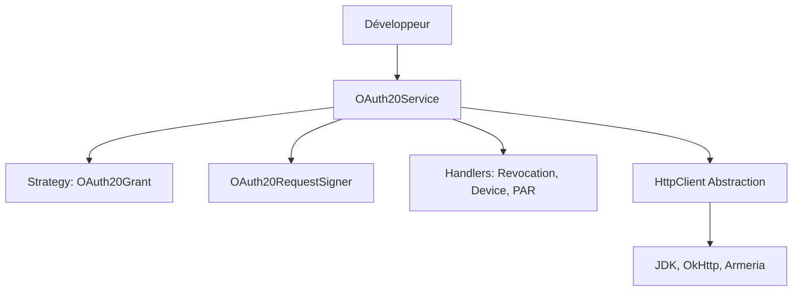

# Guide de Contribution ScribeJava

Ce document rassemble les instructions pour contribuer, les détails de l'architecture, ainsi que les guides de sécurité et de dépannage.

---

## 🏗️ Architecture & Responsabilités

ScribeJava suit une architecture modulaire et strictement **SOLID**.

### Diagramme de Flux

### Modules Maven
*   **`scribejava-core`** : Le moteur OAuth agnostique (Protocole, Signature, Abstraction HTTP).
*   **`scribejava-oidc`** : Support d'OpenID Connect (Discovery, Registration, Validation).
*   **`scribejava-apis`** : Fournisseurs concrets (Google, GitHub, etc.).
*   **`scribejava-httpclient-*`** : Adaptateurs réseau (OkHttp, Armeria, etc.).

### Responsabilités des Classes (Core)
| Composant | Rôle |
| :--- | :--- |
| **`OAuth20Service`** | Orchestrateur principal. Délègue la logique aux handlers spécialisés. |
| **`OAuth20Grant`** | [Pattern Strategy] Encapsule la création de requêtes pour chaque flux (Code, Password, etc.). |
| **`OAuth20RequestSigner`** | Gère la signature HTTP et les preuves DPoP. |
| **`OAuth20RevocationHandler`** | Gère la révocation de token (RFC 7009). |
| **`OAuth20DeviceFlowHandler`** | Gère le flux "Device Authorization" (RFC 8628). |
| **`OAuth20PushedAuthHandler`** | Gère les requêtes PAR (RFC 9126). |

---

## 🛠️ Comment contribuer

### Gestion des Branches
1.  Créez une branche à partir de `master` avec un nom explicite : `feat/ma-fonctionnalite` ou `fix/nom-du-bug`.
2.  Soumettez votre Pull Request (PR) vers la branche `master`.

### Ajouter une fonctionnalité
*   **Nouveau Grant** : Implémentez `OAuth20Grant` dans `com.github.scribejava.core.oauth2.grant`.
*   **Nouveau Provider** : Étendez `DefaultApi20` dans `scribejava-apis`. **Note** : Privilégiez systématiquement `OAuth2AccessTokenJsonExtractor` pour les nouveaux fournisseurs.
*   **Tests** : Les nouveaux tests doivent être placés dans le module correspondant. Utilisez `MockWebServer` pour simuler les réponses du serveur OAuth.

### Standards & Qualité
*   **Java 8** : Compatibilité obligatoire pour supporter les environnements legacy.
*   **TDD** : Tout code doit être testé (JUnit 5 + AssertJ). Couverture cible : **> 80%**.
*   **Checkstyle & PMD** : Lancement systématique via `mvn checkstyle:check pmd:check`.
*   **Mutation Testing** : Nous visons un score de mutation **PITest de 75% minimum** sur le code métier.

### Conventions de Commit
Nous suivons la convention **Conventional Commits**.
Exemple : `feat(core): add support for OIDC backchannel logout`
*   `feat`: Nouvelle fonctionnalité.
*   `fix`: Correction de bug.
*   `refactor`: Modification sans changement de comportement.
*   `docs`: Documentation uniquement.

---

## 💻 Configuration de l'IDE

Pour éviter les allers-retours avec la CI, nous recommandons :
*   **IntelliJ IDEA** : Installez le plugin "Checkstyle-IDEA" et importez le fichier `checkstyle.xml` du projet.
*   **Eclipse** : Utilisez le plugin "Checkstyle" et liez-le au fichier de configuration à la racine.

---

## 🔒 Politique de Sécurité

*   **Signalement** : Ne créez pas de ticket public pour une faille. Contactez les mainteneurs par email.
*   **Secrets** : Ne jamais coder de secrets en dur dans les tests ou le code. Utilisez `System.getenv()`.
*   **PKCE** : Recommandé pour tous les flux afin de prévenir l'injection de code.

---

## 📥 Guide d'Extensibilité

### Extracteur de Token Personnalisé
Implémentez `TokenExtractor<OAuth2AccessToken>` et déclarez-le dans votre classe `Api`.

### Client HTTP Personnalisé
Implémentez `com.github.scribejava.core.httpclient.HttpClient` et passez-le au `ServiceBuilder`.

---

## 🌐 Dépannage (Troubleshooting)

### Erreurs SSL (Java 8)
*   **handshake_failure** : Mettez à jour votre JDK (>= 8u251) ou forcez TLS 1.2 via `-Dhttps.protocols=TLSv1.2`.
*   **PKIX path building failed** : Importez le certificat du serveur dans `cacerts` via `keytool`.

---

## 🚀 Commandes utiles

*   **Tests parallèles** : `mvn test -T 1C -Dmaven.javadoc.skip=true`
*   **Mutation Testing** : `mvn pitest:mutationCoverage -pl scribejava-core`
*   **Javadoc locale** : `mvn javadoc:aggregate -Dmaven.test.skip=true`

---

## ✅ Checklist avant de soumettre une PR

- [ ] Le code est compatible **Java 8**.
- [ ] `mvn checkstyle:check pmd:check` passe sans erreur.
- [ ] Les nouveaux tests couvrent les cas limites (Edge cases).
- [ ] Le Mutation Score (PITest) est maintenu ou amélioré.
- [ ] Le fichier `CHANGELOG.md` a été mis à jour.
- [ ] Les messages de commit sont clairs et préfixés.
