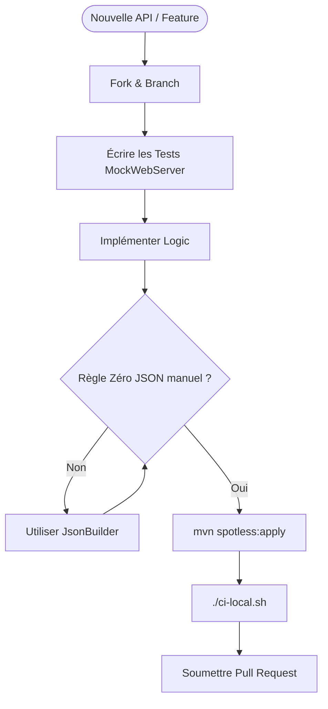
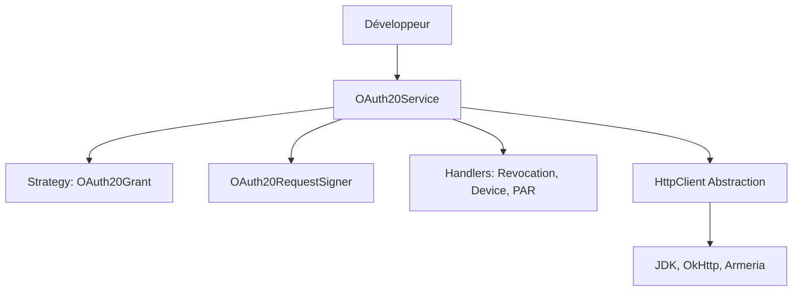

# Guide de Contribution ScribeJava

Ce document rassemble les instructions pour contribuer, les détails de l'architecture, ainsi que les guides de sécurité
et de dépannage.

---

---

## 🏗️ Cycle de Contribution

Voici les étapes pour ajouter un nouveau fournisseur (API) ou une fonctionnalité :



## 🏗️ Architecture & Responsabilités

ScribeJava suit une architecture modulaire et strictement **SOLID**.

### Diagramme de Flux



### Modules Maven

* **`scribejava-core`** : Le moteur OAuth agnostique (Protocole, Signature, Abstraction HTTP).
* **`scribejava-oidc`** : Support d'OpenID Connect (Discovery, Registration, Validation).
* **`scribejava-apis`** : Fournisseurs concrets (Google, GitHub, etc.).
* **`scribejava-httpclient-*`** : Adaptateurs réseau (OkHttp, Armeria, etc.).

### Responsabilités des Classes (Core)

| Composant                      | Rôle                                                                                          |
|:-------------------------------|:----------------------------------------------------------------------------------------------|
| **`OAuth20Service`**           | Orchestrateur principal. Délègue la logique aux handlers spécialisés.                         |
| **`OAuth20Grant`**             | [Pattern Strategy] Encapsule la création de requêtes pour chaque flux (Code, Password, etc.). |
| **`OAuth20RequestSigner`**     | Gère la signature HTTP et les preuves DPoP.                                                   |
| **`OAuth20RevocationHandler`** | Gère la révocation de token (RFC 7009).                                                       |
| **`OAuth20DeviceFlowHandler`** | Gère le flux "Device Authorization" (RFC 8628).                                               |
| **`OAuth20PushedAuthHandler`** | Gère les requêtes PAR (RFC 9126).                                                             |

---

## 🛠️ Comment contribuer

### Gestion des Branches

1. Créez une branche à partir de `master` avec un nom explicite : `feat/ma-fonctionnalite` ou `fix/nom-du-bug`.
2. Soumettez votre Pull Request (PR) vers la branche `master`.

### Ajouter une fonctionnalité

* **Nouveau Grant** : Implémentez `OAuth20Grant` dans `com.github.scribejava.core.oauth2.grant`.
* **Nouveau Provider (API)** : Voir le [Guide d'ajout d'une API](#-guide-dajout-dun-nouveau-fournisseur-api) ci-dessous.
* **Tests** : Les nouveaux tests doivent être placés dans le module correspondant. Utilisez `MockWebServer` pour simuler
  les réponses du serveur OAuth.

---

## 🔌 Guide d'ajout d'un nouveau Fournisseur (API)

L'ajout d'un support pour un nouveau service (ex: Slack, Discord, LinkedIn) se fait dans le module `scribejava-apis`.

### 1. Création de la classe API
Créez une classe dans le package `com.github.scribejava.apis` (ou un sous-package si complexe) héritant de `DefaultApi20`.

```java
public class MyNewApi extends DefaultApi20 {

    protected MyNewApi() {
    }

    private static class InstanceHolder {
        private static final MyNewApi INSTANCE = new MyNewApi();
    }

    public static MyNewApi instance() {
        return InstanceHolder.INSTANCE;
    }

    @Override
    public String getAccessTokenEndpoint() {
        return "https://api.monservice.com/oauth/token";
    }

    @Override
    protected String getAuthorizationBaseUrl() {
        return "https://www.monservice.com/oauth/authorize";
    }
}
```

### 2. Bonnes pratiques pour l'API
*   **Singleton** : Utilisez toujours le pattern `InstanceHolder` pour garantir l'unicité.
*   **Extracteur** : Par défaut, `DefaultApi20` utilise l'extracteur JSON standard. Si le service renvoie un format exotique, surchargez `getAccessTokenExtractor()`.
*   **Verbes HTTP** : Si le service exige un `GET` pour le token (rare mais arrive), surchargez `getAccessTokenVerb()`.

### 3. Ajout d'un Exemple
Créez une classe d'exemple dans `src/test/java/com/github/scribejava/apis/examples/MyNewApiExample.java`.
Cela permet aux utilisateurs de tester rapidement et sert de documentation vivante.

### 4. Validation & Tests
*   **ReflectiveApiTest** : Ajoutez votre nouvelle classe à la liste des APIs testées par réflexion pour vérifier que les URLs ne sont pas nulles.
*   **Unit Tests** : Si votre API a une logique spécifique (ex: signature particulière, paramètres obligatoires), ajoutez un test unitaire dédié.

---

### Standards & Qualité

* **Java 8** : Compatibilité obligatoire pour supporter les environnements legacy.
* **TDD** : Tout code doit être testé (JUnit 5 + AssertJ). Couverture cible : **> 80%**.
* **Checkstyle & PMD** : Lancement systématique via `mvn checkstyle:check pmd:check`.
* **Mutation Testing** : Nous visons un score de mutation **PITest de 75% minimum** sur le code métier.

### Conventions de Commit

Nous suivons la convention **Conventional Commits**.
Exemple : `feat(core): add support for OIDC backchannel logout`

* `feat`: Nouvelle fonctionnalité.
* `fix`: Correction de bug.
* `refactor`: Modification sans changement de comportement.
* `docs`: Documentation uniquement.

---

## 💻 Configuration de l'IDE

Pour éviter les allers-retours avec la CI, nous recommandons :

* **IntelliJ IDEA** : Installez le plugin "Checkstyle-IDEA" et importez le fichier `checkstyle.xml` du projet.
* **Eclipse** : Utilisez le plugin "Checkstyle" et liez-le au fichier de configuration à la racine.

---

## 🔒 Politique de Sécurité

* **Signalement** : Ne créez pas de ticket public pour une faille. Contactez les mainteneurs par email.
* **Secrets** : Ne jamais coder de secrets en dur dans les tests ou le code. Utilisez `System.getenv()`.
* **PKCE** : Recommandé pour tous les flux afin de prévenir l'injection de code.

---

## 📥 Guide d'Extensibilité

### Extracteur de Token Personnalisé

Implémentez `TokenExtractor<OAuth2AccessToken>` et déclarez-le dans votre classe `Api`.

### Client HTTP Personnalisé

Implémentez `com.github.scribejava.core.httpclient.HttpClient` et passez-le au `ServiceBuilder`.

---

## 🌐 Dépannage (Troubleshooting)

### Erreurs SSL (Java 8)

* **handshake_failure** : Mettez à jour votre JDK (>= 8u251) ou forcez TLS 1.2 via `-Dhttps.protocols=TLSv1.2`.
* **PKIX path building failed** : Importez le certificat du serveur dans `cacerts` via `keytool`.

---

## 🚀 Commandes utiles

* **Tests parallèles** : `mvn test -T 1C -Dmaven.javadoc.skip=true`
* **Mutation Testing** : `mvn pitest:mutationCoverage -pl scribejava-core`
* **Javadoc locale** : `mvn javadoc:aggregate -Dmaven.test.skip=true`

---

## ✅ Checklist avant de soumettre une PR

- [ ] Le code est compatible **Java 8**.
- [ ] `mvn checkstyle:check pmd:check` passe sans erreur.
- [ ] Les nouveaux tests couvrent les cas limites (Edge cases).
- [ ] Le Mutation Score (PITest) est maintenu ou amélioré.
- [ ] Le fichier `CHANGELOG.md` a été mis à jour.
- [ ] Les messages de commit sont clairs et préfixés.
