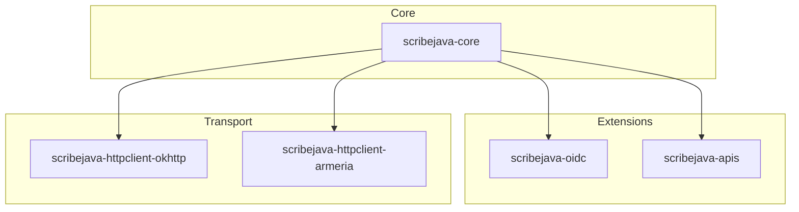

# ScribeJava :: La bibliothèque OAuth simple et robuste pour Java

[](https://github.com/Q300Z/scribejava/actions)
[](https://github.com/Q300Z/scribejava/releases)
[](https://github.com/Q300Z/scribejava/blob/master/LICENSE.txt)
[](#-compatibilité)

ScribeJava est une bibliothèque client OAuth légère, thread-safe et modulaire. Elle est conçue pour les développeurs qui exigent un contrôle total, une sécurité maximale et **zéro dépendance inutile**.

---

## 📖 Sommaire
1. [Pourquoi ScribeJava ?](#-pourquoi-scribejava)
2. [Architecture Modulaire](#-architecture-modulaire)
3. [Démarrage Rapide](#-démarrage-rapide)
4. [Installation](#-installation)
5. [Compatibilité & Android](#-compatibilité)
6. [Documentation & Exemples](#-documentation--exemples)

---

## 🌟 Pourquoi ScribeJava ?

ScribeJava est le choix idéal pour les projets qui refusent l'opacité des frameworks "tout-en-un".

### 📊 Matrice de Choix : ScribeJava vs Frameworks Lourds

| Caractéristique | ScribeJava v9 | Spring Security / Pac4j |
| :--- | :--- | :--- |
| **Poids (Core)** | **< 1 Mo** | > 50 Mo (avec dépendances) |
| **Dépendances** | **Zéro (JDK natif)** | Énorme graphe de transitivité |
| **Courbe d'apprentissage** | **Minutes** | Jours / Semaines |
| **Contrôle du flux** | **Total** | Abstraction rigide |
| **Android Ready** | **Oui (Natif)** | Difficile / Incompatible |

---

## 🏗️ Architecture Modulaire

ScribeJava est conçu comme un écosystème de composants indépendants :



---

## 🚀 Démarrage Rapide

```java
// 1. Initialisation
OAuth20Service service = new ServiceBuilder(clientId)
    .apiSecret(clientSecret)
    .build(GitHubApi.instance());

// 2. Récupération du Token (Strategy)
OAuth2AccessToken token = service.getAccessToken(new AuthorizationCodeGrant(code));

// 3. Appel API autorisé
OAuthRequest request = new OAuthRequest(Verb.GET, "https://api.github.com/user");
service.signRequest(token, request);

try (Response response = service.execute(request)) {
    System.out.println("Corps : " + response.getBody());
}
```

---

## 📦 Installation

ScribeJava est distribué via **[GitHub Releases](https://github.com/Q300Z/scribejava/releases)**.

> 💡 *Note : Remplacez **9.0.0** par la version actuelle dans les exemples ci-dessous.*

### Maven
Installez le JAR téléchargé localement :
```bash
mvn install:install-file -Dfile=scribejava-core-9.0.0.jar -DgroupId=com.github.scribejava -DartifactId=scribejava-core -Dversion=9.0.0 -Dpackaging=jar
```
Puis ajoutez la dépendance :
```xml
<dependency>
    <groupId>com.github.scribejava</groupId>
    <artifactId>scribejava-core</artifactId>
    <version>9.0.0</version>
</dependency>
```

> 🛠️ **Un problème lors de l'installation ou du build ?** Consultez le **[Guide de Dépannage](./TROUBLESHOOTING.md)**.

### Gradle (Android & JVM)
```gradle
dependencies {
    implementation files('libs/scribejava-core-9.0.0.jar')
}
```

---

## 📱 Compatibilité
*   **Java** : Compatible de Java 8 à Java 25.
*   **Android** : Support complet. Utilisez le client [OkHttp](./scribejava-httpclient-okhttp/README.md) pour de meilleures performances sur mobile.

---

## 📚 Documentation & Exemples

*   ⚡ **[Guide de Migration](MIGRATION_GUIDE.md)** - Passer de la v8 à la v9.
*   🤝 **[Guide du Contributeur](CONTRIBUTING.md)** - Architecture et Standards.
*   🛡️ **[Sécurité Avancée (DPoP/PAR)](ADVANCED_SECURITY.md)** - Guide de mise en production.
*   🛠️ **[Dépannage & Logs](TROUBLESHOOTING.md)** - Solutions aux erreurs et Débogage.
*   📖 **Modules** : [Core](./scribejava-core/README.md) | [OIDC](./scribejava-oidc/README.md) | [Catalogue APIs](./scribejava-apis/README.md)
*   🎯 **Exemples** :
    *   [OAuth 2.0 GitHub avec PKCE](./scribejava-apis/src/test/java/com/github/scribejava/apis/examples/GitHubExample.java)
    *   [OpenID Connect avec Découverte Dynamique](./scribejava-apis/src/test/java/com/github/scribejava/apis/examples/OidcDiscoveryExample.java)
    *   [Projet Enterprise Multi-Tenant (Local)](../scribejava-ee-example/README.md)

### 🏗️ API Javadoc
Nous maintenons une couverture Javadoc de 100%.
*   **[Consulter la Javadoc en ligne](https://Q300Z.github.io/scribejava/docs/)**
*   Générer localement : `make doc` (puis ouvrez `target/site/apidocs/index.html`).

---
⭐ **Soutenez-nous !** Mettez une étoile sur le projet pour nous aider à grandir.
