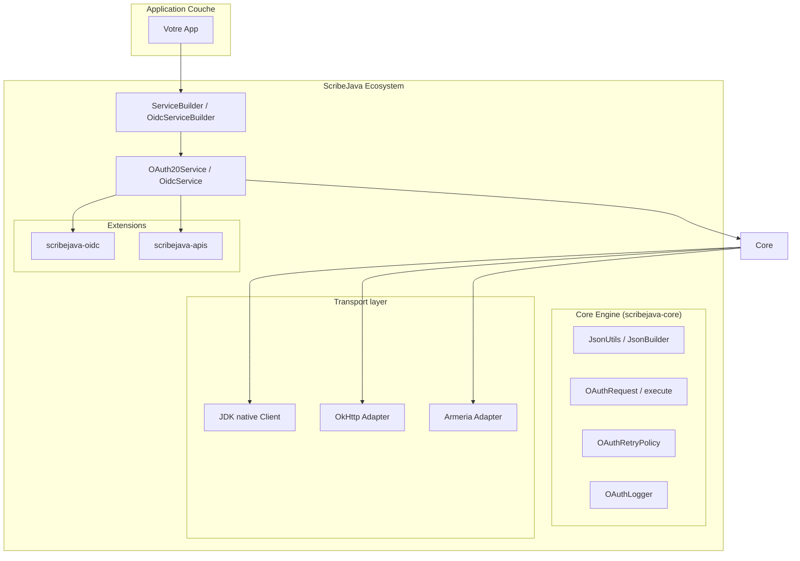

# ScribeJava :: OAuth & OIDC Zero-Dependency Edition

[](https://github.com/Q300Z/scribejava/actions)
[](https://github.com/Q300Z/scribejava/releases)
[](https://github.com/Q300Z/scribejava/blob/master/LICENSE.txt)

ScribeJava est la bibliothèque OAuth/OpenID Connect la plus légère, thread-safe et modulaire pour Java. Elle est conçue pour les systèmes critiques exigeant un contrôle total, une sécurité maximale et **zéro dépendance au runtime**.

---

## 🏗️ Architecture Modulaire

ScribeJava repose sur un découpage strict respectant les principes SOLID. Chaque module a une responsabilité unique :



---

## 🚀 Démarrage Rapide

### 1. OAuth 2.0 avec DX Premium
```java
// Configuration fluide
OAuth20Service service = new ServiceBuilder(clientId)
    .apiSecret(clientSecret)
    .callback("https://app.com/cb")
    .scopes("profile", "email")
    .build(GitHubApi.instance());

// Nouveau: Reproduction de bug facile (Secrets masqués par défaut)
System.out.println("Commande pour reproduire : " + request.toCurlCommand());
```

### 2. OpenID Connect "Enterprise Ready"
```java
// Auto-configuration via Discovery (Natif)
OidcServiceBuilder builder = new OidcServiceBuilder(clientId)
    .baseOnDiscovery("https://accounts.google.com", httpClient, userAgent);

OAuth20Service service = builder.build(new DefaultOidcApi20());

// Accès typé et sécurisé aux claims
IdToken idToken = service.extractIdToken(token);
String name = idToken.getStandardClaims().getGivenName().orElse("Utilisateur");
```

---

## 🛰️ Observabilité & Monitoring

ScribeJava v9.1 intègre des outils industriels pour la production :
- **Auto-Retry** : Encapsulation transparente des erreurs 429 (Rate Limit) et 5xx.
- **OAuthLogger** : Interface de logging structurée prête pour SLF4J/ELK.
- **RateLimitListener** : Surveillance proactive de vos quotas d'appels API.
- **OAuthNetworkException** : Distinction nette entre panne réseau et erreur protocolaire.

---

## 📦 Installation (Maven)

```xml
<dependency>
    <groupId>com.github.scribejava</groupId>
    <artifactId>scribejava-core</artifactId>
    <version>9.2.3</version>
</dependency>
```

---

## 🛠️ Développement & Qualité Industrielle

Consultez nos guides détaillés pour maîtriser l'écosystème :
- 📖 **[Catalogue des Fonctionnalités](FEATURES_CATALOG.md)** : Liste exhaustive par module.
- 🏗️ **[Documentation CI/CD](CI_DOCUMENTATION.md)** : Tout sur la qualité multi-JDK et les releases.
- 🏗️ **[Guide de Contribution](CONTRIBUTING.md)** : Comment ajouter une API ou une feature.
- 🔐 **[Sécurité Avancée](ADVANCED_SECURITY.md)** : DPoP, PAR, Chiffrement EC.
- ⚡ **[Guide de Migration](MIGRATION_GUIDE.md)** : Passer de la v8 à la v9.1.
- 📖 **[Dépannage](TROUBLESHOOTING.md)** : Erreurs courantes et solutions.

---
⭐ **Soutenez-nous !** Mettez une étoile sur le projet pour nous aider à grandir.
