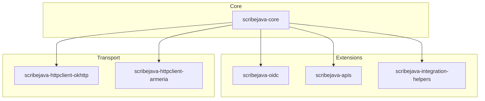

# ScribeJava :: La bibliothèque OAuth simple et robuste pour Java

[](https://github.com/Q300Z/scribejava/actions)
[](https://github.com/Q300Z/scribejava/releases)
[](https://github.com/Q300Z/scribejava/blob/master/LICENSE.txt)
[](#-compatibilité)

ScribeJava est une bibliothèque client OAuth légère, thread-safe et modulaire. Elle est conçue pour les développeurs qui
exigent un contrôle total, une sécurité maximale et **zéro dépendance inutile**.

---

## 📖 Sommaire

1. [Pourquoi ScribeJava ?](#-pourquoi-scribejava)
2. [Architecture Modulaire](#-architecture-modulaire)
3. [Démarrage Rapide](#-démarrage-rapide)
4. [Intégration OIDC Enterprise](#-intégration-oidc-enterprise)
5. [Installation](#-installation)
6. [Compatibilité & Android](#-compatibilité)
7. [Documentation & Exemples](#-documentation--exemples)

---

## 🌟 Pourquoi ScribeJava ?

ScribeJava est le choix idéal pour les projets qui refusent l'opacité des frameworks "tout-en-un".

### 📊 Matrice de Choix : ScribeJava vs Frameworks Lourds

| Caractéristique            | ScribeJava v9.1      | Spring Security / Pac4j       |
|:---------------------------|:---------------------|:------------------------------|
| **Poids (Core)**           | **< 1 Mo**           | > 50 Mo (avec dépendances)    |
| **Dépendances**            | **Zéro (JDK natif)** | Énorme graphe de transitivité |
| **Courbe d'apprentissage** | **Minutes**          | Jours / Semaines              |
| **Contrôle du flux**       | **Total**            | Abstraction rigide            |
| **Android Ready**          | **Oui (Natif)**      | Difficile / Incompatible      |

---

## 🏗️ Architecture Modulaire

ScribeJava est conçu comme un écosystème de composants indépendants :



---

## 🧠 Comment ça marche ?

ScribeJava repose sur trois piliers fondamentaux :

1.  **L'API** (`DefaultApi20`, `DefaultApi10a`) : Définit les points de terminaison (URLs) et les verbes HTTP du fournisseur (ex: GitHub, Google).
2.  **Le Service** (`OAuth20Service`) : Gère la logique d'exécution des requêtes, la signature et l'échange de jetons.
3.  **Le Grant** (`OAuth20Grant`) : Définit la stratégie d'obtention du jeton (Code, Mot de passe, Device Flow, Client Credentials).

---

## 🚀 Démarrage Rapide

### 1. OAuth 2.0 Standard (Authorization Code)
Utilisé pour les applications web et mobiles. **PKCE** (RFC 7636) est fortement recommandé pour sécuriser l'échange de code.

**Fonctionnement du PKCE :**
*   **Génération** : ScribeJava crée un `code_verifier` (secret cryptographique) et calcule son `code_challenge` (SHA-256).
*   **Autorisation** : Le challenge est envoyé au serveur dans l'URL initiale.
*   **Échange** : Le verifier secret est envoyé lors de la demande de jeton pour prouver l'identité du client.

```java
// Configuration
OAuth20Service service = new ServiceBuilder(clientId)
    .apiSecret(clientSecret)
    .callback("https://mon-app.com/callback")
    .build(GitHubApi.instance());

// Génération de l'URL d'autorisation
PKCE pkce = PKCEService.defaultInstance().generatePKCE();
String authUrl = service.createAuthorizationUrlBuilder()
    .pkce(pkce)
    .build();

// Échange du code contre un jeton
AuthorizationCodeGrant grant = new AuthorizationCodeGrant(code);
grant.setPkceCodeVerifier(pkce.getCodeVerifier());
OAuth2AccessToken token = service.getAccessToken(grant);
```

### 2. OpenID Connect (OIDC) "Enterprise Ready"
Utilisez notre coordinateur spécialisé ou l'API native pour une autonomie totale (Zero-Dependency).

#### 🪄 Configuration Magique (via Discovery)
Vous n'avez plus besoin de configurer les URLs d'API manuellement. Fournissez uniquement l'URL de l'émetteur (Issuer) :

```java
// Configure tout automatiquement à partir de /.well-known/openid-configuration
OidcServiceBuilder builder = new OidcServiceBuilder(clientId)
    .apiSecret(clientSecret)
    .baseOnDiscovery("https://accounts.google.com", httpClient, userAgent);

OAuth20Service service = builder.build(new DefaultOidcApi20());
String authUrl = service.getAuthorizationUrl(); // L'URL est découverte dynamiquement !
```

#### 🛠️ Utilisation Avancée (Découverte manuelle)
```java
// 1. Découverte dynamique des endpoints et des clés (Natif)
OidcDiscoveryService discovery = new OidcDiscoveryService(issuer, httpClient, userAgent);
OidcProviderMetadata metadata = discovery.getProviderMetadata();
Map<String, OidcKey> keys = discovery.getJwks(metadata.getJwksUri());

// 2. Initialisation du Validateur (Natif ScribeJava)
IdTokenValidator validator = new IdTokenValidator(metadata.getIssuer(), clientId, "RS256", keys);

// 3. Orchestration via Coordinateur (Helpers)
OidcAuthFlowCoordinator<String> coordinator = new OidcAuthFlowCoordinator<>(oidcService, repository);
OidcAuthResult result = coordinator.finishAuthorization(userId, code, state, sessionContext);
```

---

## 🛠️ Helpers d'Intégration (Nouveautés v9.1)

Pour les applications réelles, ScribeJava propose le module `scribejava-integration-helpers` qui orchestre tout le cycle de vie.

### 1. Auto-rafraîchissement des jetons
Le développeur ne gère plus les `refresh_token`. ScribeJava le fait silencieusement.

```java
AuthorizedClientService<String> client = new AuthorizedClientService<>(service, renewer);

// Exécute la requête : rafraîchit le jeton automatiquement s'il est expiré (Thread-safe)
Response resp = client.execute(userId, new OAuthRequest(Verb.GET, "https://api.example.com/me"));
```

### 2. Observabilité et Audit
Branchez vos logs (ELK/Grafana) pour surveiller la santé de vos connexions.

```java
service.setListener(new AuthEventListener<String>() {
    @Override
    public void onCsrfDetected(String key, String got, String expected) {
        logger.error("ALERTE SÉCURITÉ : Tentative CSRF sur l'utilisateur " + key);
    }
    // ... onTokenRefreshed, onRefreshFailed
});
```

---

## 📦 Installation

ScribeJava est distribué via **[GitHub Releases](https://github.com/Q300Z/scribejava/releases)**.

> 💡 *Note actuelle : **v9.1.0***

### Maven

Installez le JAR téléchargé localement ou utilisez votre dépôt privé :

```xml
<dependency>
    <groupId>com.github.scribejava</groupId>
    <artifactId>scribejava-core</artifactId>
    <version>9.1.0</version>
</dependency>
<dependency>
    <groupId>com.github.scribejava</groupId>
    <artifactId>scribejava-oidc</artifactId>
    <version>9.1.0</version>
</dependency>
<!-- Hautement recommandé : Pour l'automatisation et l'OIDC Enterprise -->
<dependency>
    <groupId>com.github.scribejava</groupId>
    <artifactId>scribejava-integration-helpers</artifactId>
    <version>9.1.0</version>
</dependency>
```

---

## 📱 Compatibilité

* **Java** : Compatible de Java 8 à Java 25.
* **Android** : Support complet (API 21+).

---

## 📚 Documentation & Exemples

* ⚡ **[Guide de Migration](MIGRATION_GUIDE.md)** - Passer de la v8 à la v9.
* 🛡️ **[Sécurité Avancée (DPoP/PAR)](ADVANCED_SECURITY.md)** - RFC 9449 et 9126.
* 📖 **[Guide d'Intégration Helpers](INTEGRATION_HELPERS_GUIDE.md)** - Orchestration, Auto-refresh et multi-tenant.
* 📖 **Modules** : [Core](./scribejava-core/README.md) | [OIDC](./scribejava-oidc/README.md) | [Integration Helpers](./scribejava-integration-helpers/README.md)
* 🎯 **Exemples** :
  * [OpenID Connect avec Découverte Dynamique](./scribejava-apis/src/test/java/com/github/scribejava/apis/examples/OidcDiscoveryExample.java)
  * [OIDC Enterprise avec Auto-Refresh](./scribejava-integration-helpers/src/test/java/com/github/scribejava/core/integration/OidcAuthFlowCoordinatorTest.java)

### 🏗️ API Javadoc

* **[Consulter la Javadoc en ligne](https://Q300Z.github.io/scribejava/docs/)**

---
⭐ **Soutenez-nous !** Mettez une étoile sur le projet pour nous aider à grandir.
