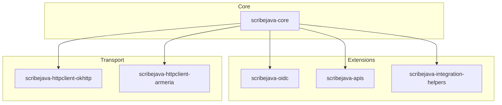

# ScribeJava :: La bibliothèque OAuth simple et robuste pour Java

[](https://github.com/Q300Z/scribejava/actions)
[](https://github.com/Q300Z/scribejava/releases)
[](https://github.com/Q300Z/scribejava/blob/master/LICENSE.txt)
[](#-compatibilité)

ScribeJava est une bibliothèque client OAuth légère, thread-safe et modulaire. Elle est conçue pour les développeurs qui
exigent un contrôle total, une sécurité maximale et **zéro dépendance inutile**.

---

## 📖 Sommaire

1. [Pourquoi ScribeJava ?](#-pourquoi-scribejava)
2. [Architecture Modulaire](#-architecture-modulaire)
3. [Démarrage Rapide](#-démarrage-rapide)
4. [Installation](#-installation)
5. [Compatibilité & Android](#-compatibilité)
6. [Documentation & Exemples](#-documentation--exemples)

---

## 🌟 Pourquoi ScribeJava ?

ScribeJava est le choix idéal pour les projets qui refusent l'opacité des frameworks "tout-en-un".

### 📊 Matrice de Choix : ScribeJava vs Frameworks Lourds

| Caractéristique            | ScribeJava v9        | Spring Security / Pac4j       |
|:---------------------------|:---------------------|:------------------------------|
| **Poids (Core)**           | **< 1 Mo**           | > 50 Mo (avec dépendances)    |
| **Dépendances**            | **Zéro (JDK natif)** | Énorme graphe de transitivité |
| **Courbe d'apprentissage** | **Minutes**          | Jours / Semaines              |
| **Contrôle du flux**       | **Total**            | Abstraction rigide            |
| **Android Ready**          | **Oui (Natif)**      | Difficile / Incompatible      |

---

## 🏗️ Architecture Modulaire

ScribeJava est conçu comme un écosystème de composants indépendants :



---

## 🧠 Comment ça marche ?

ScribeJava repose sur trois piliers fondamentaux :

1.  **L'API** (`DefaultApi20`, `DefaultApi10a`) : Définit les points de terminaison (URLs) et les verbes HTTP du fournisseur (ex: GitHub, Google).
2.  **Le Service** (`OAuth20Service`) : Gère la logique d'exécution des requêtes, la signature et l'échange de jetons.
3.  **Le Grant** (`OAuth20Grant`) : Définit la stratégie d'obtention du jeton (Code, Mot de passe, Device Flow, Client Credentials).

---

## 🚀 Démarrage Rapide

### 1. OAuth 2.0 Standard (Authorization Code)
Utilisé pour les applications web et mobiles. **PKCE** est fortement recommandé.

*   **Valeurs obligatoires** : `clientId`, `code` (obtenu après redirection).
*   **Recommandé** : `apiSecret` (pour les serveurs), `callback` (URL de retour), `PKCE`.

```java
// Configuration
OAuth20Service service = new ServiceBuilder(clientId)
    .apiSecret(clientSecret)
    .callback("https://mon-app.com/callback")
    .build(GitHubApi.instance());

// Génération de l'URL d'autorisation
PKCE pkce = PKCEService.defaultInstance().generatePKCE();
String authUrl = service.createAuthorizationUrlBuilder()
    .pkce(pkce)
    .build();

// Échange du code contre un jeton
AuthorizationCodeGrant grant = new AuthorizationCodeGrant(code);
grant.setPkceCodeVerifier(pkce.getCodeVerifier());
OAuth2AccessToken token = service.getAccessToken(grant);
```

### 2. OAuth 2.0 Device Flow (RFC 8628)
Idéal pour les appareils sans clavier ou navigateur (Smart TV, CLI, IoT).

*   **Valeurs obligatoires** : `clientId`, `scope`.
*   **Fonctionnement** : Pas de secret client ni de callback requis.

```java
OAuth20Service service = new ServiceBuilder(clientId).build(GoogleApi20.instance());

// 1. Demande des codes à l'appareil (scope obligatoire pour Google/Microsoft)
DeviceAuthorization codes = service.getDeviceAuthorizationCodes("email profile");
System.out.println("Allez sur " + codes.getVerificationUri() + " et entrez " + codes.getUserCode());

// 2. Sondage (Polling) jusqu'à validation par l'utilisateur
OAuth2AccessToken token = service.pollAccessToken(codes);
```

### 3. OpenID Connect (OIDC)
Pour l'identité et la découverte automatique des serveurs.

*   **Valeurs obligatoires** : `issuerUrl` (ex: `https://accounts.google.com`).
*   **Avantage** : Vous n'avez pas besoin de connaître les URLs d'autorisation ou de token, elles sont découvertes.

```java
// Découverte via l'URL de l'issuer
OidcDiscoveryService discovery = new OidcDiscoveryService("https://accounts.google.com");
OidcProviderMetadata metadata = discovery.getMetadata();

OidcService service = (OidcService) new ServiceBuilder(clientId)
    .build(new DefaultOidcApi20(metadata));

// Le jeton contient un ID Token validable
OpenIdOAuth2AccessToken token = service.getAccessToken(new AuthorizationCodeGrant(code));
IdToken idToken = IdToken.parse(token.getOpenIdToken());
```

### 4. OAuth 1.0a (Legacy)
Pour les anciens services (Twitter v1, Flickr, Tumblr).

*   **Valeurs obligatoires** : `apiKey`, `apiSecret`, `oauth_verifier` (obtenu après redirection).

```java
OAuth10aService service = new ServiceBuilder(apiKey)
    .apiSecret(apiSecret)
    .build(TwitterApi.instance());

// 1. Obtention du Request Token
OAuth1RequestToken requestToken = service.getRequestToken();

// 2. URL d'autorisation
String authUrl = service.getAuthorizationUrl(requestToken);

// 3. Échange contre l'Access Token (verifier obligatoire)
OAuth1AccessToken accessToken = service.getAccessToken(requestToken, oauthVerifier);
```

### 5. Autres Flux (Machine-to-Machine)
*   **Client Credentials** : Requiert `clientId` + `apiSecret`. Utilisé pour les scripts serveurs.
    `service.getAccessToken(ClientCredentialsGrant.INSTANCE);`
*   **Resource Owner Password** : Requiert `clientId`, `username`, `password`. (Déconseillé par l'IETF).
    `service.getAccessToken(new PasswordGrant(user, pass));`

---

## 📦 Installation

ScribeJava est distribué via **[GitHub Releases](https://github.com/Q300Z/scribejava/releases)**.

> 💡 *Note : Remplacez **9.0.0** par la version actuelle dans les exemples ci-dessous.*

### Maven

Installez le JAR téléchargé localement :

```bash
mvn install:install-file -Dfile=scribejava-core-9.0.0.jar -DgroupId=com.github.scribejava -DartifactId=scribejava-core -Dversion=9.0.0 -Dpackaging=jar
```

Puis ajoutez la dépendance :

```xml
<dependency>
    <groupId>com.github.scribejava</groupId>
    <artifactId>scribejava-core</artifactId>
    <version>9.0.0</version>
</dependency>
<!-- Optionnel : Pour faciliter l'intégration (Auto-refresh, Storage) -->
<dependency>
    <groupId>com.github.scribejava</groupId>
    <artifactId>scribejava-integration-helpers</artifactId>
    <version>9.0.0</version>
</dependency>
```

> 🛠️ **Un problème lors de l'installation ou du build ?** Consultez le **[Guide de Dépannage](./TROUBLESHOOTING.md)**.

### Gradle (Android & JVM)

```gradle
dependencies {
    implementation files('libs/scribejava-core-9.0.0.jar')
}
```

---

## 📱 Compatibilité

* **Java** : Compatible de Java 8 à Java 25.
* **Android** : Support complet. Utilisez le client [OkHttp](./scribejava-httpclient-okhttp/README.md) pour de
  meilleures performances sur mobile.

---

## 📚 Documentation & Exemples

* ⚡ **[Guide de Migration](MIGRATION_GUIDE.md)** - Passer de la v8 à la v9.
* 🤝 **[Guide du Contributeur](CONTRIBUTING.md)** - Architecture et Standards.
* 🛡️ **[Sécurité Avancée (DPoP/PAR)](ADVANCED_SECURITY.md)** - Guide de mise en production.
* 🛠️ **[Dépannage & Logs](TROUBLESHOOTING.md)** - Solutions aux erreurs et Débogage.
* 📖 **Modules** : [Core](./scribejava-core/README.md) | [OIDC](./scribejava-oidc/README.md) | [Helpers d'Intégration](./scribejava-integration-helpers/README.md) | [Catalogue APIs](./scribejava-apis/README.md)
* 🎯 **Exemples** :
  * [OAuth 2.0 GitHub avec PKCE](./scribejava-apis/src/test/java/com/github/scribejava/apis/examples/GitHubExample.java)
  * [OpenID Connect avec Découverte Dynamique](./scribejava-apis/src/test/java/com/github/scribejava/apis/examples/OidcDiscoveryExample.java)
  * [Projet Enterprise Multi-Tenant (Local)](../scribejava-ee-example/README.md)

### 🏗️ API Javadoc

Nous maintenons une couverture Javadoc de 100%.

* **[Consulter la Javadoc en ligne](https://Q300Z.github.io/scribejava/docs/)**
* Générer localement : `make doc` (puis ouvrez `target/site/apidocs/index.html`).

---
⭐ **Soutenez-nous !** Mettez une étoile sur le projet pour nous aider à grandir.
