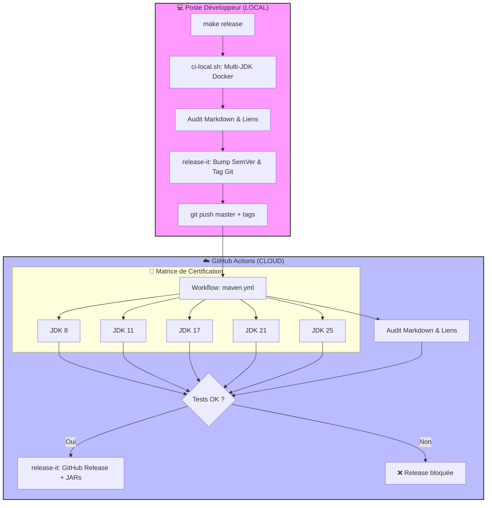
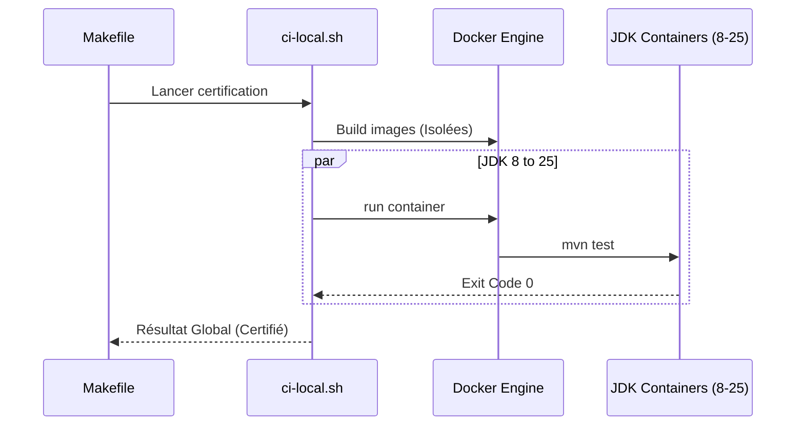

# 🏗️ Documentation CI/CD ScribeJava

Ce document détaille l'infrastructure de Continuous Integration (CI) et Continuous Delivery (CD) de ScribeJava v9.2.4+. Notre pipeline est conçu pour garantir la règle **Zéro-Dépendance** et la stabilité sur une matrice de **5 versions de JDK**.

---

## 1. Vue d'ensemble de l'Architecture "Zero-Touch"

Le pipeline sépare strictement la préparation humaine (Local) de la certification et distribution industrielle (Cloud).

---

## 2. Standardisation et Maintenance

L'intégrité du projet est maintenue par des processus automatisés :

*   **Zero-Dependency Enforcement** : Le plugin `maven-enforcer` bloque le build si une dépendance interdite (Jackson, Nimbus, org.json) est détectée au runtime.
*   **Pure Java Certification** : Depuis la v9.2.4, le module `integration-helpers` est certifié sans aucune dépendance de logging (retrait de SLF4J), garantissant une portabilité totale sans conflit de classpath.
*   **Dependabot** : Surveillance hebdomadaire des vulnérabilités.

---

## 3. Cycle de Release Industrielle (`release-it`)

Nous utilisons **`release-it`** comme moteur unique pour garantir un versionnage sémantique (SemVer) sans erreur humaine.

### Le Triple Verrou de Sécurité :
1.  **Verrou Local** : `make release` lance `./ci-local.sh`. La release s'arrête si un test casse sur un des 5 JDKs.
2.  **Verrou Cloud** : Le workflow `maven.yml` ré-exécute l'intégralité de la matrice sur les serveurs GitHub pour audit.
3.  **Verrou de Publication** : La commande `release-it --github.release` n'est invoquée que si les tests cloud sont un succès total.

---

## 4. Documentation et Artefacts "Premium DX"

*   **Javadoc Automatisée (`deploy-docs.yml`)** : Publication continue sur GitHub Pages.
*   **JARs Unifiés** : Les JARs de distribution incluent les `.class`, les sources et la documentation agrégée.
*   **Typed Builders** : Les builders OIDC retournent désormais nativement le type `OidcService`, éliminant les `ClassCastException` et améliorant l'expérience développeur.

---

## 5. Matrice de Certification multi-JDK

Le script `ci-local.sh` est le garant de la robustesse :

---
*Dernière mise à jour : Mars 2026 - Certifié Enterprise Edition v9.2.4* ✅
