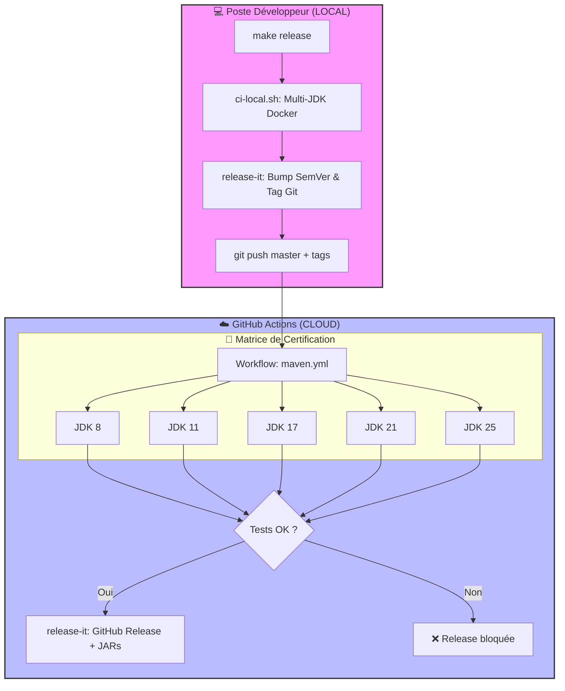
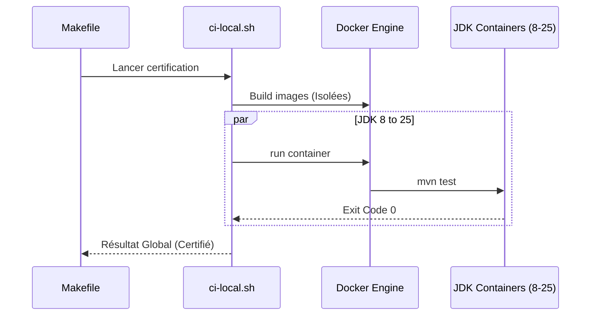

# 🏗️ Documentation CI/CD ScribeJava

Ce document détaille l'infrastructure de Continuous Integration (CI) et Continuous Delivery (CD) de ScribeJava v9.2.4+. Notre pipeline est conçu pour garantir la règle **Zéro-Dépendance** et la stabilité sur une matrice de **5 versions de JDK**.

---

## 1. Vue d'ensemble de l'Architecture "Zero-Touch"

Le pipeline sépare strictement la préparation humaine (Local) de la certification et distribution industrielle (Cloud).

---

## 2. Standardisation et Maintenance

L'intégrité du projet est maintenue par des processus automatisés de surveillance :

*   **Dependabot (`dependabot.yml`)** : Surveille les dépendances Maven (hebdomadaire) et les GitHub Actions (mensuel). Toute mise à jour génère une PR testée par le CI.
*   **Templates de Contribution** :
    *   `bug_report.md` : Force la fourniture du JDK et du client HTTP pour un diagnostic immédiat.
    *   `PULL_REQUEST_TEMPLATE.md` : Checklist imposant le respect des principes **SOLID**, du lintage et du Mutation Testing.

---

## 3. Cycle de Release Industrielle (`release-it`)

Nous utilisons **`release-it`** comme moteur unique pour garantir un versionnage sémantique (SemVer) sans erreur humaine.

### Le Triple Verrou de Sécurité :
1.  **Verrou Local** : `make release` lance `./ci-local.sh`. La release s'arrête si un test casse sur un des 5 JDKs.
2.  **Verrou Cloud** : Le workflow `maven.yml` ré-exécute l'intégralité de la matrice sur les serveurs GitHub pour audit.
3.  **Verrou de Publication** : La commande `release-it --github.release` n'est invoquée que si le point 2 est un succès total.

---

## 4. Documentation et Artefacts "Premium DX"

ScribeJava v9.2.4+ automatise la diffusion de la connaissance technique :

*   **Javadoc Automatisée (`deploy-docs.yml`)** : À chaque push sur `master`, la Javadoc agrégée est recompilée et publiée sur GitHub Pages.
*   **JARs Unifiés** : Le hook `before:github:release` de `release-it` produit des JARs contenant les `.class` et les sources de documentation pour une aide contextuelle immédiate dans les IDE.

---

## 5. Matrice de Certification multi-JDK

Le script `ci-local.sh` est le cœur battant de la robustesse du projet :

---
*Dernière mise à jour : Février 2026 - Certifié Enterprise Edition v9.2.4* ✅
