# 🗺️ Guide des Flux Architecturaux (Enterprise Edition)

Ce document détaille les mécanismes internes de ScribeJava v9.2.x, illustrant comment le module `core` et le module `oidc` collaborent pour gérer le cycle de vie des identités.

---

## 1. Flux de Connexion OIDC (Login)
Ce flux intègre la **Découverte Dynamique**, le **PKCE** et la **Validation Native** de l'ID Token.

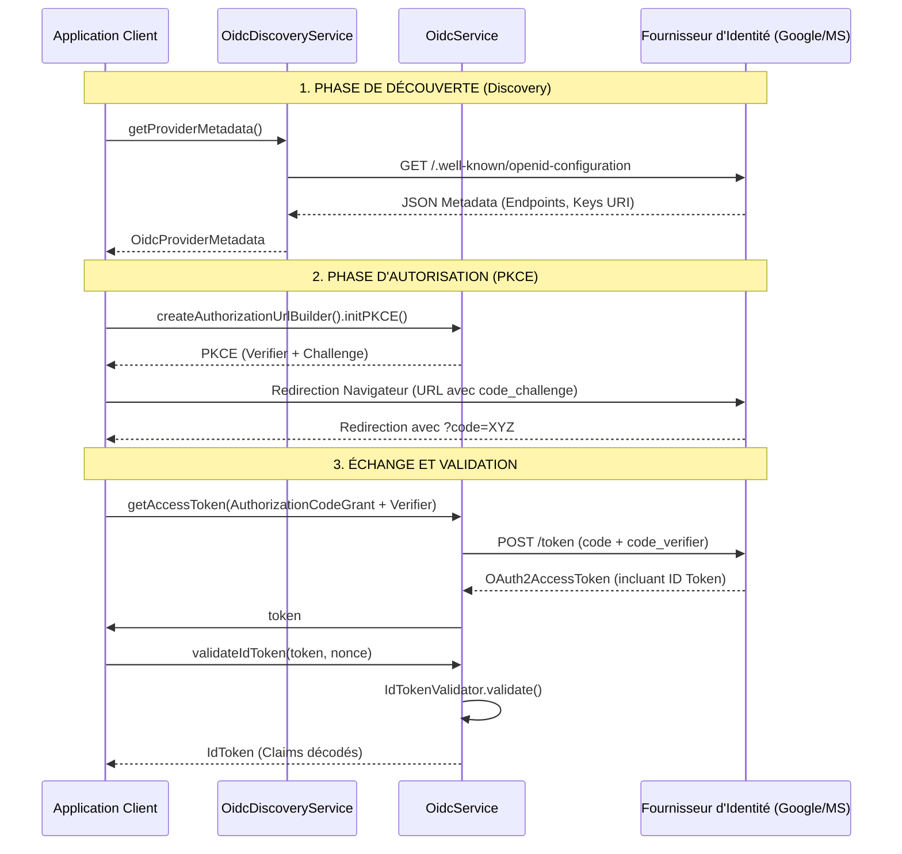

**Classes Clés :**
*   `OidcDiscoveryService` : Gère l'appel au point de terminaison de découverte.
*   `AuthorizationUrlBuilder` : Orchestre la construction de l'URL et l'initialisation du `PKCE`.
*   `AuthorizationCodeGrant` : Stratégie d'échange du code.
*   `IdTokenValidator` : Valide la signature cryptographique (RSA/EC) et les claims (`iss`, `aud`, `exp`).

---

## 2. Flux de Déconnexion (Logout)
ScribeJava supporte la déconnexion hybride : technique (révocation) et utilisateur (fin de session).

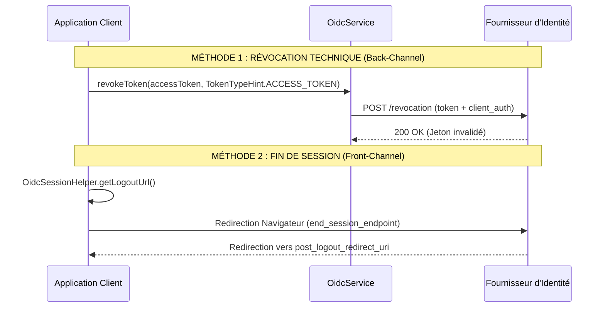

**Points de terminaison impliqués :**
*   **Revocation Endpoint** : Défini par `metadata.getRevocationEndpoint()`.
*   **End Session Endpoint** : URL vers laquelle l'utilisateur est redirigé pour le Logout SSO.

---

## 3. Flux de Renouvellement (Refresh Token)
Gestion de la persistance sans intervention de l'utilisateur.

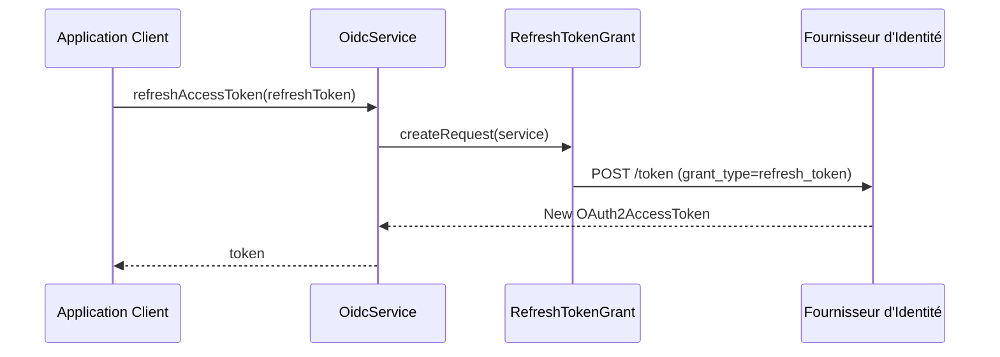

**Classes Clés :**
*   `RefreshTokenGrant` : Encapsule les paramètres `refresh_token` et `client_id/secret`.
*   `OAuth2AccessToken` : Contient le nouveau jeton et sa date d'expiration calculée via `getExpiresAt()`.

---

## 4. Orchestration Enterprise (Integration Helpers)
Le module `integration-helpers` automatise la gestion du cycle de vie des jetons et la sécurité CSRF, évitant ainsi au développeur de manipuler manuellement les jetons.

### 4.1. Fin de Flux Orchestrée (Callback)
Le `OidcAuthFlowCoordinator` centralise toutes les validations de retour.

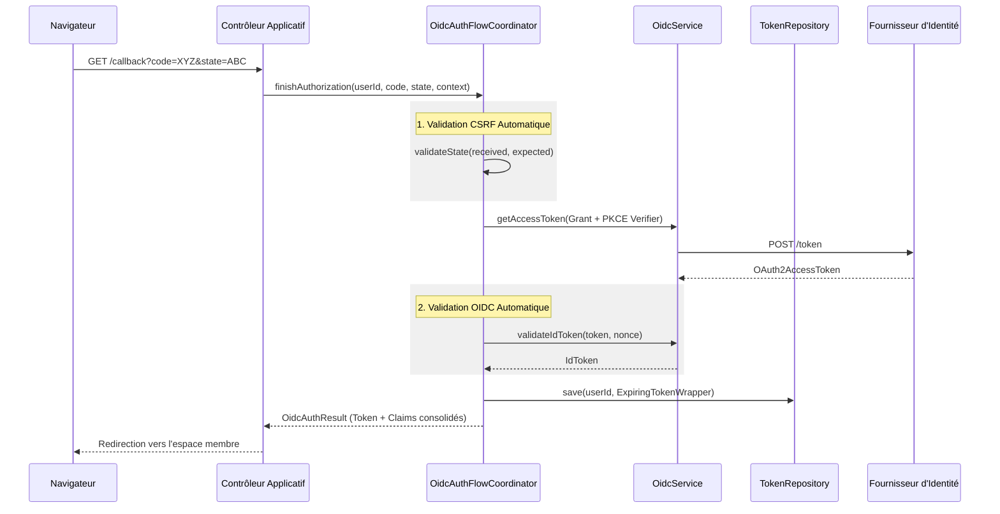

### 4.2. Appel API avec Auto-Renouvellement
Le `AuthorizedClientService` exécute des requêtes sans que le développeur ne se soucie de l'expiration du jeton.

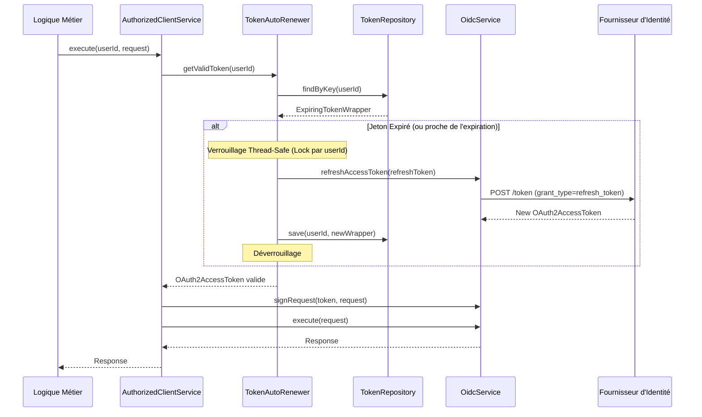

---

## 📊 Comparaison : Standard vs Orchestré

| Caractéristique | Flux Standard (`core`) | Flux Orchestré (`helpers`) |
| :--- | :--- | :--- |
| **Gestion du State** | Manuelle (Session) | Automatique via `AuthFlowCoordinator` |
| **Validation PKCE** | Manuelle (Stockage verifier) | Automatique via `AuthSessionContext` |
| **Refresh Token** | Manuel (Vérification `isExpired`) | Transparent via `TokenAutoRenewer` |
| **Concurrence** | Risque de Race Condition | Thread-safe avec verrouillage par clé |
| **Stockage** | Code spécifique à l'app | Abstraction via `TokenRepository` |

---
## 🛠️ Matrice des Méthodes Enterprise

| Opération | Classe | Méthode | Standard |
| :--- | :--- | :--- | :--- |
| **Discovery** | `OidcDiscoveryService` | `getProviderMetadata()` | RFC 8414 / OIDC Disc |
| **PKCE** | `AuthorizationUrlBuilder` | `initPKCE()` | RFC 7636 |
| **Signature** | `OAuth20RequestSigner` | `signRequest(token, req)` | RFC 6750 |
| **Révocation** | `OAuth20Service` | `revokeToken(token, hint)` | RFC 7009 |
| **DPoP** | `DPoPProofCreator` | `createDPoPProof(req, token)` | RFC 9449 |

---

## 5. Résilience Industrielle (Retry Policy)
Le moteur de ScribeJava intègre une boucle de résilience capable de gérer les erreurs transitoires (Rate Limit, Instabilité serveur).

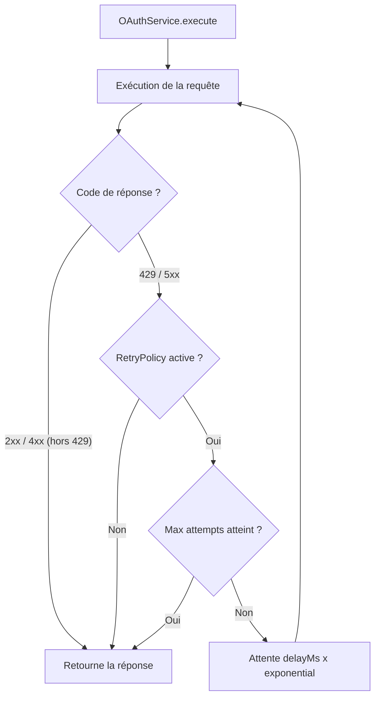

---

## 6. Observabilité et Diagnostic (Redaction)
La sécurité est maintenue même dans les logs grâce au mécanisme de masquage automatique des secrets.

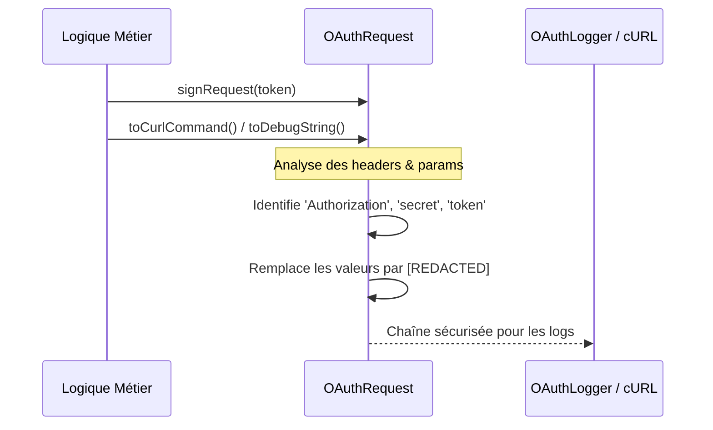

---

## 7. Cryptographie Native OIDC (Validation JWT)
ScribeJava n'utilise pas de bibliothèque externe (Zéro-Dépendance) pour valider les signatures.

```mermaid
flowDiagram
    ID[ID Token String] --> Parse[Jwt.parse: Base64 Decoding]
    Parse --> Header[Header: kid, alg]
    Parse --> Payload[Claims: iss, sub, aud, exp]
    Header --> Lookup{Recherche kid dans JWKS}
    Lookup -- Trouvé --> Crypto[Signature.verify: java.security]
    Lookup -- Absent --> Refresh[Rotation: Rechargement JWKS]
    Refresh --> Crypto
    Crypto --> Claims[Validation temporelle: iat < now < exp]
    Claims --> Final[IdToken Validé]
```

---

## 8. Authentification Client (Pattern Strategy)
Flexible pour s'adapter à toutes les exigences des fournisseurs.

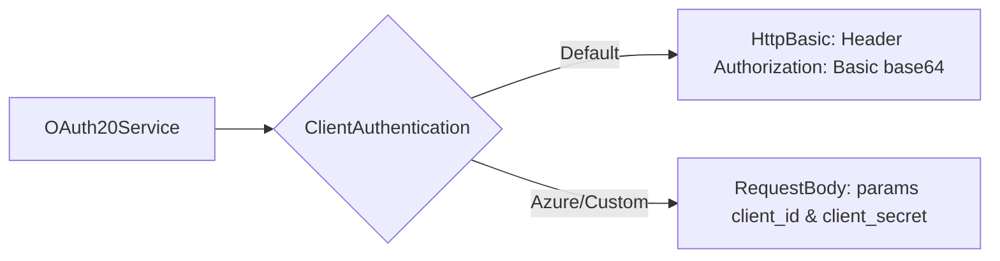

---

## 9. Pipeline d'Intercepteurs (Extensibilité)
Modification modulaire des requêtes avant l'envoi.

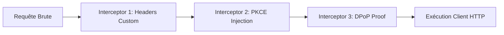

---

## 10. Liaison Cryptographique DPoP (RFC 9449)
Lien indissociable entre le jeton et la clé privée du client.

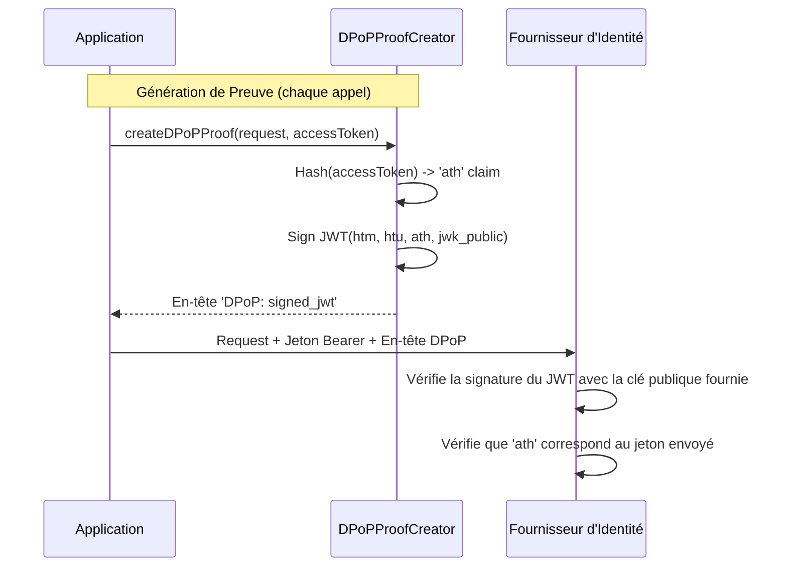

---

## 11. Pushed Authorization Requests (PAR - RFC 9126)
Le flux le plus sécurisé pour l'initiation : les paramètres ne passent plus par l'URL du navigateur.

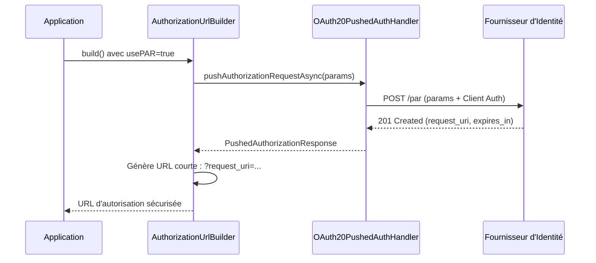

---

## 12. Polling du Device Flow (RFC 8628)
Gestion intelligente de l'attente active pour les terminaux IoT/Console.

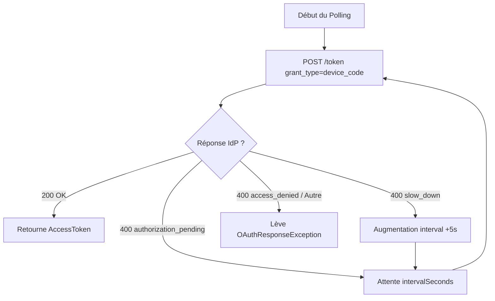

---

## 13. Découverte du Client HTTP (ServiceLoader)
Comment ScribeJava maintient son autonomie "Zero-Dependency" au runtime.

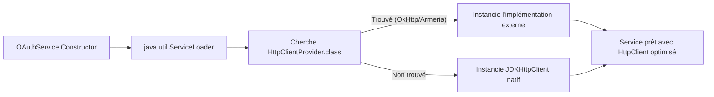

---

## 14. JWT-Secured Authorization Request (JAR - RFC 9101)
Encapsulation cryptographique de la demande d'autorisation.

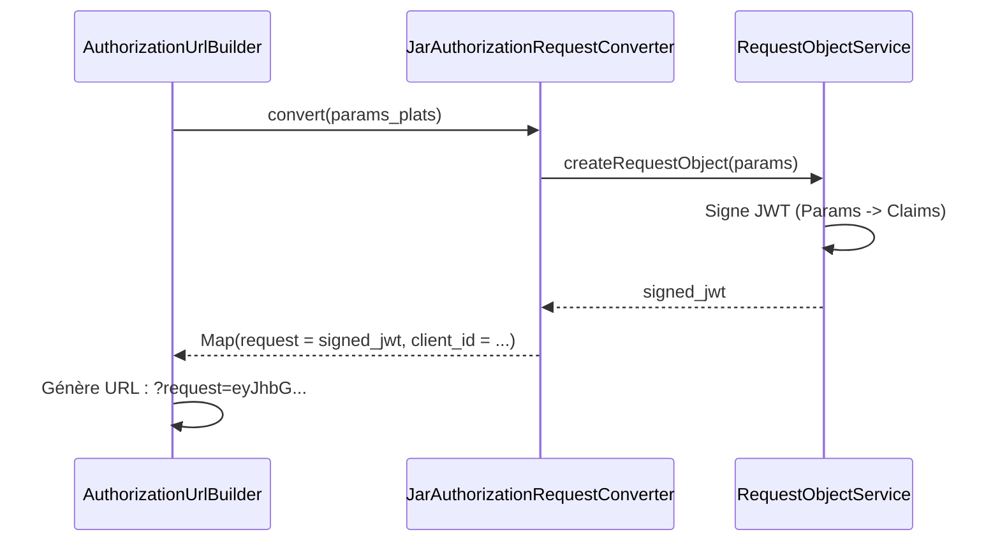

---

## 15. Enregistrement Dynamique (RFC 7591)
Auto-provisioning pour les environnements de confiance ou de test.

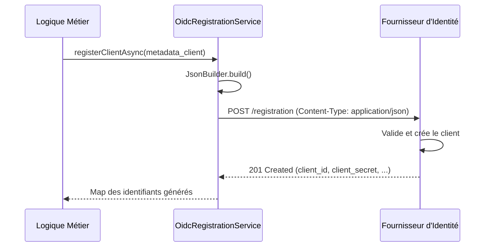

---

## 16. Orchestration Multi-Tenant (OAuthServiceRegistry)
Centralisation de la gestion de multiples fournisseurs et clients au sein d'une même instance applicative.

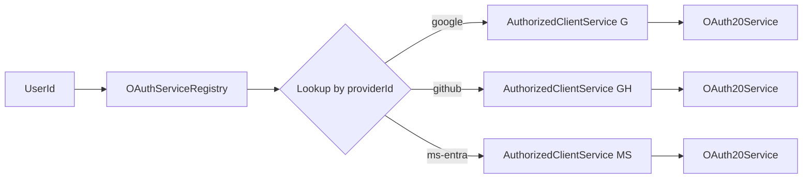

---

## 17. Moteur JSON Natif (Zéro-Dépendance)
Analyse récursive via expressions régulières pour garantir l'autonomie totale du runtime.

```mermaid
graph TD
    JSON[JSON String] --> Loop[JsonUtils.parse loop]
    Loop --> Match{Regex Pattern Match}
    Match -- "Pair Key:Value" --> Type{Type de Valeur ?}
    Type -- "String/Number/Bool" --> Map[Ajout à la Map courante]
    Type -- "Object { ... }" --> Rec[Appel Récursif (max depth 32)]
    Type -- "Array [ ... ]" --> Arr[Analyse de la liste]
    Rec --> Loop
    Arr --> Loop
    Map --> Loop
    Loop -- "Fin de chaîne" --> Result[Map finale d'objets Java]
```

---

## 18. Système d'Audit et d'Événements (Hooks)
Points d'ancrage pour le monitoring et la traçabilité métier.

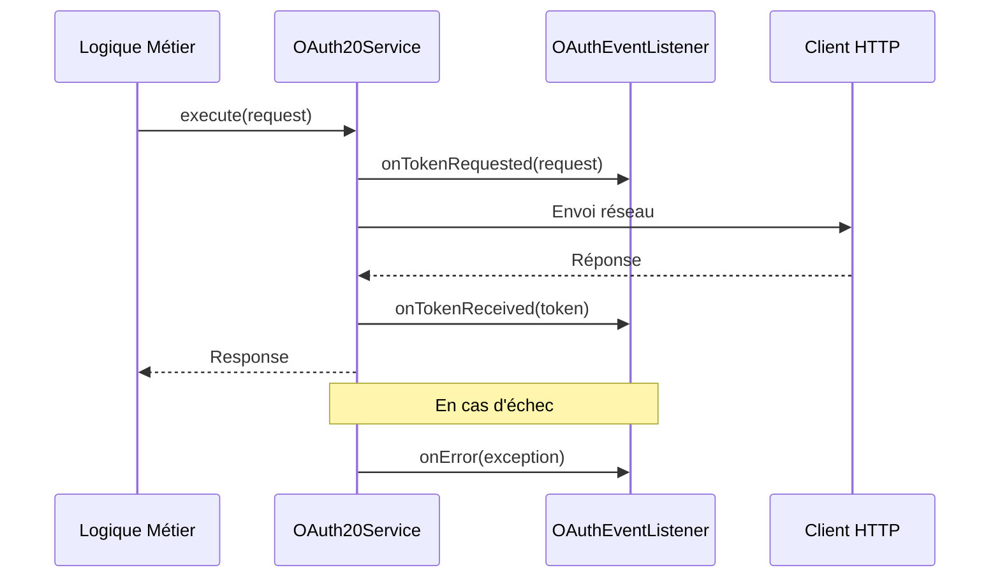

---

## 19. Pont des Adaptateurs HTTP (Bridge Pattern)
Découplage entre les modèles ScribeJava et les bibliothèques tierces.

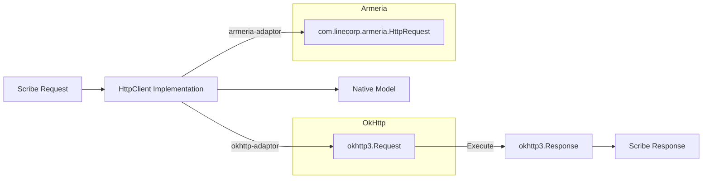

---

## 20. Stratégie de Cache de Découverte OIDC
Optimisation des performances et réduction de la charge réseau IdP.

```mermaid
graph TD
    Start[OidcDiscoveryCache.getMetadata] --> Check{Présent en cache ?}
    Check -- Oui --> Return[Retourne les métadonnées]
    Check -- Non --> Lock[Verrouillage par issuerUri]
    Lock --> Check2{Toujours absent ?}
    Check2 -- Non --> Return
    Check2 -- Oui --> Fetch[Appel Réseau /.well-known]
    Fetch --> Store[Mise en cache thread-safe]
    Store --> Return
```

---
[⬅️ Retour au README principal](../README.md)
