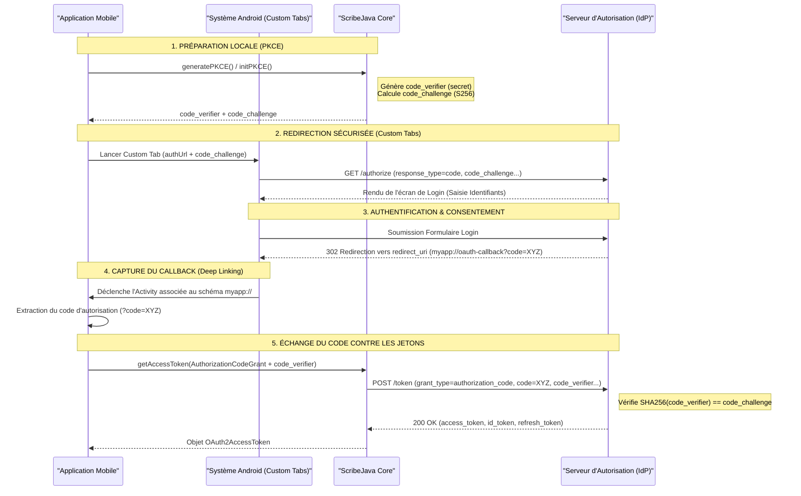
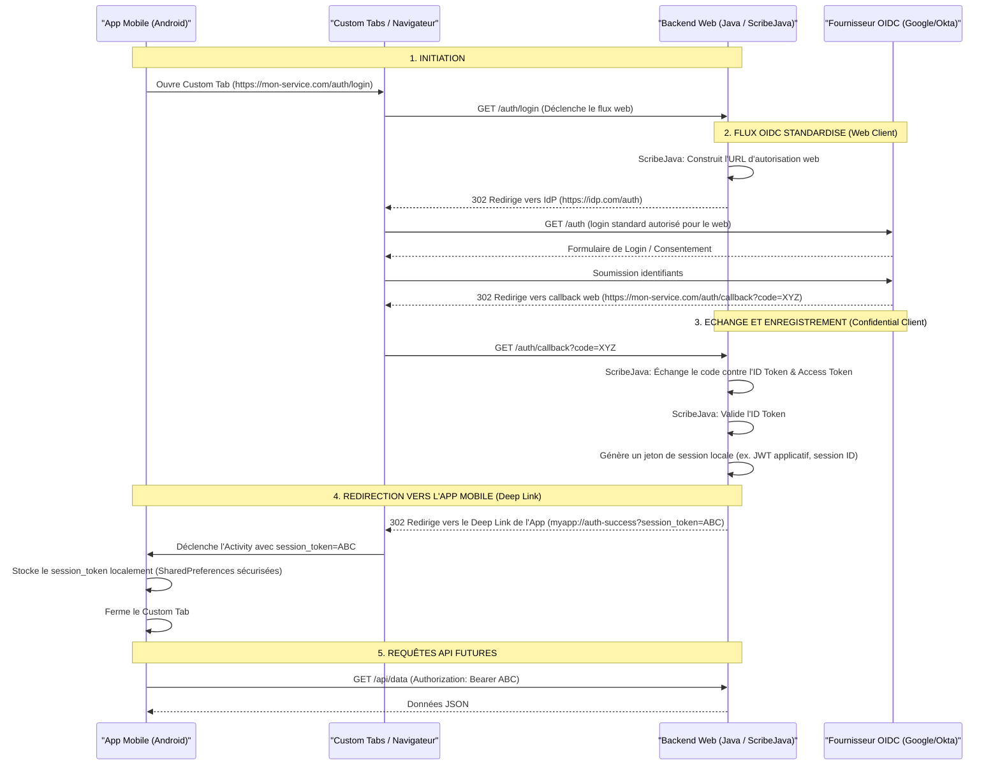

# 📱 Guide d'intégration sur Android

Grâce à sa compatibilité stricte avec le **JDK 8** et son architecture **Zero-Dependency** au runtime, ScribeJava est extrêmement légère, performante et parfaitement adaptée au développement d'applications mobiles Android.

Ce guide explique comment configurer et intégrer ScribeJava dans une application Android, en respectant les bonnes pratiques de sécurité modernes (PKCE, Custom Tabs, et exécution asynchrone).

---

## 🎯 1. Pourquoi utiliser ScribeJava sur Android ?

1. **Légèreté absolue** : Les bibliothèques d'authentification d'entreprise (comme Spring Security, Pac4j ou AppAuth) pèsent souvent plusieurs dizaines de mégaoctets et importent des centaines de dépendances. Le Core de ScribeJava pèse moins de **300 Ko**, ce qui limite l'impact sur la taille de votre APK.
2. **Compatibilité Totale** : Fonctionne sur toutes les versions d'Android (de l'API 19 à la plus récente) sans nécessiter de mécanisme lourd de désucrage (desugaring) du bytecode.
3. **Transport Flexible** : Vous pouvez utiliser le client HTTP natif du JDK ou injecter le client standard d'Android : **OkHttp 4**, assurant un excellent partage des pools de connexion et des performances réseaux optimales.

---

## 🛠️ 2. Configuration et Dépendances

Dans le fichier `build.gradle` (module `app`) de votre projet Android, ajoutez les dépendances suivantes. Il est fortement recommandé d'utiliser le module de transport **OkHttp** de ScribeJava sur Android :

```groovy
dependencies {
    // ScribeJava Core
    implementation 'com.github.scribejava:scribejava-core:9.4.0'
    // Transport OkHttp recommandé pour Android
    implementation 'com.github.scribejava:scribejava-httpclient-okhttp:9.4.0'
    
    // Pour l'ouverture sécurisée du navigateur (Android Custom Tabs)
    implementation 'androidx.browser:browser:1.8.0'
}
```

---

## 🔑 3. Configuration du Redirection Link (Deep Linking)

Pour recevoir le code d'autorisation après la connexion de l'utilisateur, vous devez déclarer un filtre d'intention (Intent Filter) dans votre **`AndroidManifest.xml`** lié à l'activité qui gérera le callback :

```xml
<activity android:name=".AuthCallbackActivity"
          android:exported="true">
    
    <!-- Filtre d'intention pour capturer le Deep Link de redirection -->
    <intent-filter>
        <action android:name="android.intent.action.VIEW" />
        <category android:name="android.intent.category.DEFAULT" />
        <category android:name="android.intent.category.BROWSABLE" />
        
        <!-- Définit votre redirect URI : myapp://oauth-callback -->
        <data android:scheme="myapp" android:host="oauth-callback" />
    </intent-filter>
</activity>
```

---

## 🗺️ 4. Flux de Connexion Mobile (PKCE + Deep Linking)

Les applications mobiles étant des **clients publics** (qui ne peuvent pas garder de secrets en toute sécurité), elles doivent obligatoirement utiliser le flux **Authorization Code avec PKCE** (RFC 8252) couplé à des **onglets personnalisés (Custom Tabs)** et des **Deep Links**.

### Diagramme de Séquence



### Description Pas-à-Pas et Échange de Données

#### Étape 1 : Préparation et Génération du PKCE
Puisqu'un pirate pourrait intercepter le Deep Link de redirection (`myapp://oauth-callback`) sur le téléphone, le PKCE (Proof Key for Code Exchange) garantit que seule l'application mobile ayant initié la requête d'autorisation peut récupérer les jetons.
* **Génération locale :** ScribeJava génère une chaîne aléatoire cryptographiquement forte : le `code_verifier`.
* **Calcul du Challenge :** ScribeJava applique un hash SHA-256 sur cette chaîne puis l'encode en Base64URL pour obtenir le `code_challenge`.

#### Étape 2 : Redirection via Custom Tabs
L'application lance un onglet de navigateur sécurisé (Custom Tab) partagé avec le navigateur système de l'appareil.
* **Données de redirection (Paramètres GET de l'URL d'autorisation) :**
  * `response_type=code` : Demande un code d'autorisation.
  * `client_id` : Identifiant public de l'application mobile.
  * `redirect_uri=myapp://oauth-callback` : L'URI personnalisée de redirection déclarée dans le Manifeste Android.
  * `scope` : Les permissions demandées (ex: `openid profile`).
  * `state` : Clé de validation unique pour contrer les injections CSRF.
  * `code_challenge` : Le challenge calculé à l'étape 1.
  * `code_challenge_method=S256` : Indique que le challenge est haché en SHA-256.

#### Étape 3 : Consentement de l'utilisateur
L'utilisateur s'authentifie de manière isolée et sécurisée. L'application mobile n'a aucun accès aux identifiants (mot de passe, authentification multifacteur) saisis dans le Custom Tab.

#### Étape 4 : Capture du Callback (Deep Linking)
Une fois validé, l'IdP renvoie une redirection HTTP vers `myapp://oauth-callback?code=XYZ&state=ABC`.
Le système d'exploitation Android intercepte le schéma `myapp` et redirige ces paramètres GET vers votre activité de callback (`AuthCallbackActivity`).

#### Étape 5 : Échange du Code contre les Jetons (POST Back-Channel)
L'application mobile envoie le code temporaire et le code verifier d'origine pour prouver sa légitimité.
* **Données envoyées (Requête POST au `token_endpoint`) :**
  * `grant_type=authorization_code`
  * `code` : Le code d'autorisation reçu à l'étape 4.
  * `redirect_uri` : Doit correspondre à `myapp://oauth-callback`.
  * `client_id` : L'identifiant client de l'application mobile.
  * `code_verifier` : **Crucial** : Le secret en clair généré à l'étape 1.
  *(Note : Le secret client `client_secret` n'est PAS envoyé car les applications mobiles sont des clients publics).*
* **Données de réponse de l'IdP :**
  Le serveur d'autorisation hache le `code_verifier` fourni et vérifie qu'il correspond au `code_challenge` enregistré à l'étape 2. S'il correspond, il renvoie les jetons :
  * `access_token` : Permet d'appeler l'API.
  * `id_token` : Jeton OIDC contenant l'identité de l'utilisateur (à valider localement).
  * `refresh_token` : Permet d'obtenir de nouveaux jetons en arrière-plan sans ré-authentification de l'utilisateur.

---

## 🚀 5. Exemple d'Intégration Complet

Sur Android, **toutes les requêtes réseau sont interdites sur le Thread Principal (UI Thread)** sous peine de lever une exception `NetworkOnMainThreadException`. Nous devons exécuter les appels ScribeJava de manière asynchrone (via Executors, Coroutines Kotlin ou RxJava).

Voici l'implémentation complète d'une activité initiant le flux avec **GitHub** et le sécurisant avec **PKCE** (fortement recommandé sur mobile) :

### Étape A : L'activité de connexion (`LoginActivity.java`)

```java
package com.mycompany.myapp;

import android.net.Uri;
import android.os.Bundle;
import android.widget.Button;
import androidx.appcompat.app.AppCompatActivity;
import androidx.browser.customtabs.CustomTabsIntent;
import com.github.scribejava.apis.GitHubApi;
import com.github.scribejava.core.builder.ServiceBuilder;
import com.github.scribejava.httpclient.okhttp.OkHttpHttpClientConfig;
import com.github.scribejava.core.oauth.OAuth20Service;
import java.util.concurrent.ExecutorService;
import java.util.concurrent.Executors;

public class LoginActivity extends AppCompatActivity {

    // Service OAuth20 et Executor pour les tâches en arrière-plan
    private OAuth20Service oauthService;
    private final ExecutorService executor = Executors.newSingleThreadExecutor();

    @Override
    protected void onCreate(Bundle savedInstanceState) {
        super.onCreate(savedInstanceState);
        setContentView(R.layout.activity_login);

        // 1. Configuration de ScribeJava avec le client OkHttp
        oauthService = new ServiceBuilder("votre-client-id")
                .callback("myapp://oauth-callback")
                .httpClientConfig(OkHttpHttpClientConfig.defaultConfig())
                .build(GitHubApi.instance());

        Button btnLogin = findViewById(R.id.btn_login);
        btnLogin.setOnClickListener(v -> initiateOAuthFlow());
    }

    private void initiateOAuthFlow() {
        // 2. Génération de l'URL d'autorisation en arrière-plan avec PKCE
        executor.execute(() -> {
            com.github.scribejava.core.oauth.AuthorizationUrlBuilder builder = oauthService.createAuthorizationUrlBuilder()
                    .initPKCE(); // ✅ Active et génère automatiquement le challenge PKCE
            
            // Stockez builder.getPkce().getCodeVerifier() de manière persistante (ex. SharedPreferences)
            // pour l'utiliser lors de la phase de callback.
            saveCodeVerifier(builder.getPkce().getCodeVerifier());

            final String authUrl = builder.build();

            // 3. Retour sur le thread principal pour lancer Custom Tabs
            runOnUiThread(() -> {
                CustomTabsIntent.Builder tabsBuilder = new CustomTabsIntent.Builder();
                CustomTabsIntent customTabsIntent = tabsBuilder.build();
                // Ouvre le navigateur sécurisé natif
                customTabsIntent.launchUrl(LoginActivity.this, Uri.parse(authUrl));
            });
        });
    }

    private void saveCodeVerifier(String verifier) {
        // Exemple : stocker dans les SharedPreferences ou en mémoire de l'application
    }
}
```

---

### Étape B : L'activité de capture du callback (`AuthCallbackActivity.java`)

Une fois la connexion réussie, Android capture la redirection et lance l'activité associée avec les paramètres `code` et `state` dans l'Intent.

```java
package com.mycompany.myapp;

import android.content.Intent;
import android.net.Uri;
import android.os.Bundle;
import android.widget.TextView;
import android.widget.Toast;
import androidx.appcompat.app.AppCompatActivity;
import com.github.scribejava.apis.GitHubApi;
import com.github.scribejava.core.builder.ServiceBuilder;
import com.github.scribejava.core.oauth2.grant.AuthorizationCodeGrant;
import com.github.scribejava.core.model.OAuth2AccessToken;
import com.github.scribejava.core.model.OAuthRequest;
import com.github.scribejava.core.model.Response;
import com.github.scribejava.core.model.Verb;
import com.github.scribejava.core.oauth.OAuth20Service;
import java.util.concurrent.ExecutorService;
import java.util.concurrent.Executors;

public class AuthCallbackActivity extends AppCompatActivity {

    private OAuth20Service oauthService;
    private final ExecutorService executor = Executors.newSingleThreadExecutor();
    private TextView tvStatus;

    @Override
    protected void onCreate(Bundle savedInstanceState) {
        super.onCreate(savedInstanceState);
        setContentView(R.layout.activity_callback);
        tvStatus = findViewById(R.id.tv_status);

        oauthService = new ServiceBuilder("votre-client-id")
                .callback("myapp://oauth-callback")
                .build(GitHubApi.instance());

        handleIntent(getIntent());
    }

    private void handleIntent(Intent intent) {
        Uri uri = intent.getData();
        if (uri != null && uri.toString().startsWith("myapp://oauth-callback")) {
            // Extraction du code d'autorisation retourné par le serveur
            final String code = uri.getQueryParameter("code");

            if (code != null) {
                exchangeCodeForToken(code);
            } else {
                Toast.makeText(this, "Erreur : Code non trouvé dans la redirection", Toast.LENGTH_SHORT).show();
            }
        }
    }

    private void exchangeCodeForToken(String code) {
        tvStatus.setText("Échange du code d'autorisation contre le jeton...");

        // Exécution en arrière-plan obligatoire
        executor.execute(() -> {
            try {
                // 1. Échange du code d'autorisation avec PKCE
                final AuthorizationCodeGrant grant = new AuthorizationCodeGrant(code);
                // Récupérez le code verifier stocké lors de l'initiation de l'authentification
                final String codeVerifier = getStoredCodeVerifier();
                grant.setPkceCodeVerifier(codeVerifier);

                final OAuth2AccessToken accessToken = oauthService.getAccessToken(grant);
                
                // 2. Appel immédiat d'une ressource signée pour test
                final OAuthRequest request = new OAuthRequest(Verb.GET, "https://api.github.com/user");
                oauthService.signRequest(accessToken, request);
 
                try (Response response = oauthService.execute(request)) {
                    final String userBody = response.getBody();
                    
                    // Mise à jour de l'interface graphique sur le thread principal
                    runOnUiThread(() -> tvStatus.setText("Profil récupéré :\n" + userBody));
                }
            } catch (Exception e) {
                e.printStackTrace();
                runOnUiThread(() -> tvStatus.setText("Erreur d'authentification : " + e.getMessage()));
            }
        });
    }

    private String getStoredCodeVerifier() {
        // Exemple : récupérer depuis les SharedPreferences
        return "verifier-sauvegarde";
    }
}
```

---

## 💡 6. Alternative : Proxy d'Authentification Backend (BFF Pattern)

Dans certains cas, il est **impossible de configurer le fournisseur OIDC pour une application mobile** (par exemple, si le fournisseur exige un client confidentiel avec un `client_secret` qu'il est interdit d'embarquer dans l'application mobile, ou s'il refuse les redirections vers des schémas personnalisés mobiles comme `myapp://`).

La solution recommandée est le pattern **BFF (Backend-For-Frontend)**. L'application mobile n'interagit jamais directement avec l'émetteur OIDC. C'est le serveur web de votre service (Backend) qui gère l'authentification OIDC (via ScribeJava) et délivre une session locale sécurisée à l'application mobile.

### Diagramme d'Architecture (BFF)



### Avantages de cette approche :
1. **Sécurité Maximale des Secrets :** Le `client_secret` du fournisseur OIDC et les jetons d'accès ou d'identité originaux (`access_token`, `id_token`) restent stockés de manière sécurisée dans la mémoire du serveur Backend. Ils ne sont jamais exposés sur le téléphone de l'utilisateur.
2. **Compatibilité Totale avec l'IdP :** Du point de vue du fournisseur d'identité, il s'agit d'un flux d'authentification web standard. Il n'a pas besoin de savoir qu'une application mobile est impliquée à l'origine.
3. **Gestion Centralisée de la Session :** Le serveur backend peut invalider ou rafraîchir les sessions de manière autonome sans dépendre de la logique du client mobile.

---

## 🔒 7. Bonnes Pratiques de Sécurité sur Mobile

1. **Utilisez obligatoirement PKCE (via `initPKCE()`)** : Les applications mobiles sont des clients dits "publics" qui ne peuvent pas stocker de `client_secret` de manière sécurisée (toute clé dans l'APK peut être extraite par ingénierie inverse). L'utilisation de PKCE (en appelant `.initPKCE()` sur l' `AuthorizationUrlBuilder` et en passant le code verifier à l' `AuthorizationCodeGrant`) protège votre application contre l'interception de code d'autorisation par des applications malveillantes sur le même appareil.
2. **Bannissez les WebViews intégrées** : N'affichez jamais la page de connexion dans une `WebView` classique intégrée à votre application. Les serveurs d'autorisation (comme Google ou Microsoft) les bloquent souvent pour prévenir le phishing. Privilégiez toujours les **Android Custom Tabs** (`androidx.browser:browser`), qui partagent les cookies de session du navigateur système, évitant ainsi à l'utilisateur de ressaisir ses identifiants s'il est déjà connecté.
