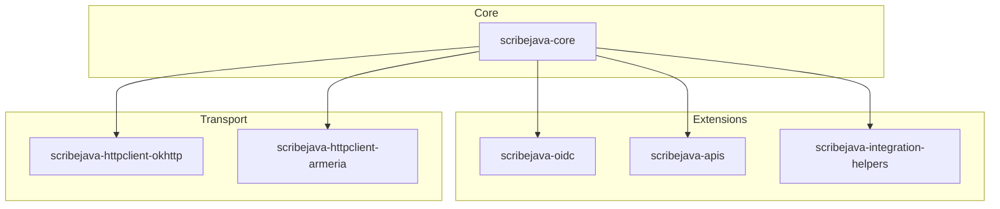

# ScribeJava : La bibliothèque OAuth simple et robuste pour Java et Android

Bienvenue sur le Hub officiel de Documentation de **ScribeJava**.

ScribeJava est une bibliothèque client OAuth légère, thread-safe, modulaire et conçue pour être **Zero-Dependency** au runtime. Elle est le choix idéal pour les projets qui refusent l'opacité et le poids des frameworks "tout-en-un" complexes.

---

## 🚀 Pourquoi ScribeJava ?

ScribeJava a été créée pour offrir aux développeurs un contrôle total et une sécurité maximale sans importer des dizaines de dépendances transitives.

### 📊 Tableau Comparatif

| Caractéristique | ScribeJava v9.4.x | Spring Security / Pac4j |
| :--- | :--- | :--- |
| **Poids (Core)** | **< 1 Mo** | > 50 Mo (avec dépendances) |
| **Dépendances** | **Zéro (JDK natif)** | Énorme graphe de transitivité |
| **Courbe d'apprentissage** | **Quelques minutes** | Plusieurs jours / semaines |
| **Contrôle du flux** | **Total et direct** | Abstraction rigide |
| **Android Ready** | **Oui (Natif)** | Difficile / Incompatible |

---

## 🏗️ Architecture Modulaire

ScribeJava est structuré en plusieurs modules indépendants, vous permettant de n'importer que ce dont vous avez réellement besoin.



* **`scribejava-core`** : Contient le moteur OAuth, la gestion des requêtes, le parseur JSON natif et le pattern *Strategy* pour les Grants.
* **`scribejava-oidc`** : Implémentation native et autonome du protocole OpenID Connect 1.0 (sans dépendance Nimbus).
* **`scribejava-integration-helpers`** : Outils de haut niveau pour l'orchestration thread-safe, l'auto-renouvellement et la persistance des jetons.
* **`scribejava-apis`** : Configurations pré-établies pour des dizaines de fournisseurs d'identité (GitHub, Google, Microsoft, Okta, etc.).

---

## ⚡ En route en 3 étapes

### 1. Ajoutez les Dépendances Maven

```xml
<dependency>
    <groupId>com.github.scribejava</groupId>
    <artifactId>scribejava-core</artifactId>
    <version>9.4.4</version>
</dependency>
<dependency>
    <groupId>com.github.scribejava</groupId>
    <artifactId>scribejava-oidc</artifactId>
    <version>9.4.4</version>
</dependency>
```

### 2. Configurez le Service

```java
OAuth20Service service = new ServiceBuilder(clientId)
    .apiSecret(clientSecret)
    .callback("https://mon-app.com/callback")
    .build(GitHubApi.instance());
```

### 3. Obtenez le Jeton et Exécutez une Requête Signée

```java
// Échange du code reçu
AuthorizationCodeGrant grant = new AuthorizationCodeGrant(code);
OAuth2AccessToken token = service.getAccessToken(grant);

// Signature de la requête API
OAuthRequest request = new OAuthRequest(Verb.GET, "https://api.github.com/user");
service.signRequest(token, request);

try (Response response = service.execute(request)) {
    System.out.println(response.getBody());
}
```

---

## 📖 Contenu de la Documentation

Parcourez nos guides détaillés via le menu de navigation ou lancez une recherche globale instantanée en haut du site :

* 🚀 **[Guide de Démarrage Rapide](tutorials/quickstart.md)** : Apprenez à lancer les exemples pour tous les flux (OAuth2, OIDC, M2M, Device Flow).
* ⚙️ **[ScribeJava Core (Moteur)](explanations/core-features.md)** : Plongez dans le fonctionnement des requêtes HTTP, de la résilience (Auto-Retry) et du logging.
* 🔐 **[OpenID Connect (OIDC)](explanations/oidc-features.md)** : Découverte dynamique, validation d'ID Token native et gestion de session.
* 🛠️ **[Helpers d'Intégration](how-to/auto-refresh-tokens.md)** : Automatisation robuste avec rafraîchissement thread-safe des jetons.
* 🛡️ **[Sécurité Avancée](how-to/secure-with-dpop-pkce.md)** : Implémentez PKCE, DPoP (Proof of Possession) et PAR (Pushed Authorization Requests).
* 🔒 **[Durcissement en Production](how-to/security-hardening.md)** : Les meilleures pratiques indispensables de sécurité pour le déploiement.
* 🔌 **[Ajouter un Fournisseur Custom](how-to/add-custom-provider.md)** : Étendez facilement la bibliothèque pour vos propres serveurs d'autorisation OAuth.
* 📱 **[Intégration Android](how-to/integrate-android.md)** : Guide complet pour implémenter ScribeJava sur Android de manière sécurisée.
* 🤝 **[Guide du Contributeur](https://github.com/Q300Z/scribejava/blob/master/CONTRIBUTING.md)** : Architecture interne, standards de qualité et processus de contribution.
* 🚨 **[Politique de Sécurité](https://github.com/Q300Z/scribejava/blob/master/SECURITY.md)** : Comment nous signaler des failles de sécurité de manière responsable et chiffrée.
* 🏗️ **[Consulter la Javadoc des APIs](https://q300z.github.io/scribejava/apidocs/)** : Accédez à la documentation de référence des classes et méthodes de la bibliothèque.
